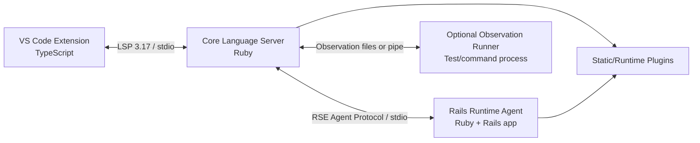
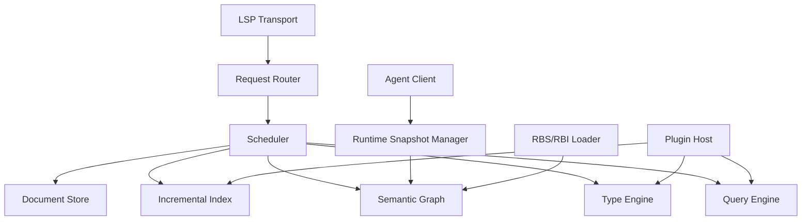

# Ruby Semantic LSP 設計パッケージ

作業名: **Ruby Semantic LSP (RSLSP)**  
目的: RubyおよびRailsに対して、型注釈を必須とせず、静的解析・Rails実行時情報・任意の実行観測を統合した高精度なVS Code向け言語機能を提供する。

このパッケージは、AI実装エージェントへ順番に渡して開発を開始できる粒度で構成している。

## 最初に読む順序

1. `docs/01-product-requirements.md`
2. `docs/02-architecture.md`
3. `docs/03-semantic-engine.md`
4. `docs/04-runtime-agent.md`
5. `docs/05-protocol.md`
6. `docs/06-plugin-system.md`
7. `docs/07-vscode-extension.md`
8. `docs/08-implementation-plan.md`
9. `docs/09-test-strategy.md`
10. `docs/10-ai-execution-guide.md`
11. `docs/11-risk-register.md`

設計判断は`adrs/`、最初の実装タスクは`tasks/`に分離している。

## 採用する基本方針

- VS Code拡張は薄いTypeScriptクライアントとする。
- LSPサーバー本体はRubyで独立実装する。
- Railsを起動する処理はLSP本体から分離し、ワークスペースごとにRuntime Agentを子プロセスとして起動する。
- VS Codeとの通信は標準LSP 3.17、内部通信はJSON-RPC 2.0互換の独自プロトコルを`Content-Length`フレーミングでstdio上に流す。
- 構文解析はPrismを使用する。
- 型情報はRBS/RBI、静的推論、Rails DSL、実行時reflection、任意の観測結果を統合する。
- 情報は「確定・高確度・推定・観測のみ・不明」の出所付きで保持する。
- Railsプロセスが停止・起動失敗しても、静的解析機能は継続する。
- 初期版ではRuby LSPアドオンやRuby LSP本体への依存を避ける。設計と実装は参考にするが、内部APIの変化に製品基盤を依存させない。

## 初期対応範囲

- Ruby 3.3以上
- Rails 7.1以上
- VS Code
- Bundlerベースの単一Railsアプリ
- CRuby
- `.rb`、`.rake`、`Gemfile`、ERBの基本対応

これは技術的上限ではなく、MVPの互換性範囲を狭めるための判断である。

## MVPの完成条件

次のコードで、補完・Hover・定義ジャンプが一貫して動くこと。

```ruby
user = User.find(params[:id])
user.company.orders.first&.total
```

期待される推論:

```text
User.find                    -> User
User#company                 -> Company
Company#orders               -> ActiveRecord::Relation[Order]
Relation[Order]#first        -> Order | nil
Order#total                  -> BigDecimal またはDB型に対応するRuby型
&.total                      -> BigDecimal | nil
```

加えて次を満たすこと。

- `post_path(post)`を補完できる。
- ルートヘルパーから`config/routes.rb`とcontroller actionへ移動できる。
- `belongs_to :company`から生成される`company`と`company=`を認識できる。
- DBカラムをインスタンスメソッドとして認識できる。
- Rails Agentが落ちた場合、静的機能を維持して状態を表示できる。
- 未保存バッファはRails実行時スナップショットより優先される。

## 非目標

初期段階では次を実装しない。

- 任意のメタプログラミングの完全解決
- 絶対安全なRename
- 全Ruby実装への対応
- 全Railsバージョンへの対応
- 既存Ruby LSPとのプロセス統合
- 本番Railsサーバーへの接続
- 値そのものを保存する実行トレース
- デバッガ
- フォーマッタの独自実装

## 参考にした公式資料

- VS Code Language Server Extension Guide: https://code.visualstudio.com/api/language-extensions/language-server-extension-guide
- Language Server Protocol 3.17: https://microsoft.github.io/language-server-protocol/specifications/lsp/3.17/specification/
- Prism: https://ruby.github.io/prism/
- RBS: https://github.com/ruby/rbs
- Ruby LSP: https://github.com/Shopify/ruby-lsp
- Ruby LSP Rails: https://github.com/Shopify/ruby-lsp-rails
- Rails autoloading/reloading: https://guides.rubyonrails.org/autoloading_and_reloading_constants.html


---

# START HERE

## 推奨する最初の作業

1. このディレクトリ全体を新規repositoryの`docs/design/`へ置く。
2. `tasks/001-bootstrap-core-and-vscode.md`をAI実装エージェントへ渡す。
3. Task 001の完了報告とdiffを別AIまたは人間がレビューする。
4. `tasks/002-prism-file-summary.md`へ進む。

## AIへ最初に渡すプロンプト

```text
添付の設計文書一式に従って、tasks/001-bootstrap-core-and-vscode.mdを実装してください。

重要条件:
- docs/02-architecture.mdで定義されたプロセス境界を変更しない。
- タスク範囲外のPrism、Rails、型推論を先行実装しない。
- stdoutにはLSP protocol以外を出力しない。
- UTF-16位置変換のテストを必ず含める。
- 既存テストを削除または緩和しない。
- 実装完了後、変更ファイル、設計判断、実行したテスト、既知の制約を報告する。
```

## 最初の技術判断

- Core: Ruby
- Parser: Prism（Task 002から）
- VS Code client: TypeScript + `vscode-languageclient/node`
- Test: RSpec + Vitest + VS Code integration test
- Transport: stdio + Content-Length framing
- Repository: monorepo

## 判断を保留してよい項目

Task 001では以下を確定しなくてよい。

- composed bundleの最終方式
- RBS/RBI優先順位の詳細
- Runtime observation
- plugin公開API
- Rails version adapter
- persistent cache形式


---

# 01. Product Requirements

## 1. 背景

Ruby/Railsの開発支援は、構文解析や定数ナビゲーションでは実用的だが、receiver型の追跡、戻り値をまたぐメソッドチェーン、Rails DSLが生成する宣言、DBスキーマ、controller-view間のデータフローで精度が大きく落ちる。

本製品は「すべてのRubyを完全に静的解析する」ことを目標にしない。代わりに、一般的なRubyコードと規約的なRailsコードで発生する編集操作を高精度に処理し、解析不能な部分だけを明示的に不確実として扱う。

## 2. 製品目標

### P0: 日常編集の中心を成立させる

- completion
- hover
- go to definition
- signature help
- diagnostics
- document/workspace symbols

### P1: Rails固有の意味を理解する

- routes
- Active Record columns
- associations
- enums
- attributes
- scopes
- controller actions
- views and partials
- common Rails conventions

### P2: 型情報を漸進的に統合する

- RBS
- RBI
- source inference
- runtime reflection
- optional observed types

### P3: 不確実性を隠さない

結果には必ずprovenanceとconfidenceを保持する。UIでは通常は簡潔に表示し、必要時に根拠を確認できるようにする。

## 3. 想定利用者

- 型注釈を全面導入していないRails開発者
- Ruby LSPより深い補完を求める開発者
- 大規模Railsコードベースの保守担当
- Rails DSLや独自gemの開発者
- AIコーディングエージェントを利用するチーム

## 4. 主要ユースケース

### UC-01: Active Record chain completion

```ruby
order = current_user.company.orders.pending.first
order.
```

`order`を`Order | nil`として提示する。

### UC-02: Route helper completion

```erb
<%= link_to "編集", edit_admin_project_
```

現在のRouteSetから候補、引数、controller actionを提示する。

### UC-03: Controller to view propagation

```ruby
# users_controller.rb
@user = User.find(params[:id])
```

```erb
<!-- show.html.erb -->
<%= @user.
```

`User`のメソッドとDBカラムを補完する。

### UC-04: DSL definition navigation

```ruby
user.company
```

`belongs_to :company`の宣言行へ移動し、必要なら`Company`クラスへ第二候補として移動する。

### UC-05: Partial failure

DB未起動、initializer失敗、migration未適用でも、Ruby構文・定数・局所型推論は動作する。

## 5. 品質目標

### レイテンシ

- keystroke起因completion: p50 50ms以下、p95 150ms以下
- hover/definition: p95 200ms以下
- 保存後の単一ファイル再解析: p95 300ms以下
- Rails snapshot更新: UIをブロックしない

### メモリ

初期目標:

- 10万行規模RailsアプリでCore Server 1.5GB以下
- Runtime AgentはRailsアプリの通常boot相当 + 300MB以下の追加

### 安定性

- Core Serverの障害とRuntime Agentの障害を分離する。
- 1リクエストの例外でプロセスを終了しない。
- 最後に成功したRuntime Snapshotを保持する。
- 古い情報にはstaleフラグを付ける。

## 6. UX原則

- 推定候補を無根拠に確定表示しない。
- 同名メソッドを無差別に大量表示しない。
- Runtime Agentが必要な機能だけを遅延起動できる。
- Workspace Trustが無効な場合はRailsをbootしない。
- 通常操作中にinitializerログを通知として大量表示しない。
- エラーはOutput Channelに集約し、Status Barは状態だけを表示する。

## 7. 機能優先順位

### MVP

1. document synchronization
2. Prism parse
3. workspace symbol index
4. local variable type inference
5. method return summaries
6. completion/hover/definition
7. Runtime Agent lifecycle
8. routes
9. Active Record schema/associations
10. controller-view instance variable propagation

### v0.2

- enums
- scopes
- ActiveModel attributes
- concerns
- partial locals
- RBS loading
- RBI import
- signature help

### v0.3

- find references
- guarded rename
- runtime observation
- plugin SDK
- custom Rails engine support

## 8. 成功指標

- 代表的なRails fixture群で、期待completionのTop-5含有率90%以上
- 明確な定義参照でdefinition precision 95%以上
- Runtime AgentなしでもMVP静的テストの80%以上を通過
- 解析不能時にクラッシュせずUnknownへ縮退する割合100%
- 変更後1秒以内に対象ファイルの結果が更新されること


---

# 02. Architecture

## 1. 結論

推奨構成は4層である。



### VS Code Extension

- プロセス起動
- LSP client
- workspace trust
- status UI
- commands
- settings
- logs

解析ロジックを持たせない。

### Core Language Server

- LSP endpoint
- document store
- Prism parsing
- incremental index
- semantic graph
- type inference
- request scheduling
- cache
- Rails snapshot merge
- plugin host

### Rails Runtime Agent

- `bin/rails runner`で起動
- Rails applicationのboot
- routes、models、schema、associations等の抽出
- reload
- Runtime plugins
- DB connection cleanup

### Observation Runner

- opt-in
- testまたは任意コマンドを別プロセスで実行
- workspace内メソッドの引数型・戻り値型を収集
- 値は記録しない
- 推論の根拠ではなく補助evidenceとして扱う

## 2. なぜVS Code拡張内に解析器を置かないか

- Extension HostのCPU・メモリを圧迫する。
- Ruby環境、Bundler、Rails bootとNode.jsを混在させる必要が生じる。
- VS Code以外への展開が困難になる。
- クラッシュ境界がなくなる。
- 公式VS CodeのLanguage Server構成も、clientとserverを別プロセスにすることを前提としている。

## 3. なぜCore ServerとRails Agentを分けるか

Rails bootは任意のアプリケーションコードを実行する。initializer、DB接続、外部サービス、ファイル監視、子プロセスなどがCore Serverの安定性を破壊し得る。

分離によって次を得る。

- Rails Agentが落ちても静的解析を継続できる。
- Agentだけを再起動できる。
- Railsのstdout汚染を隔離できる。
- Ruby/Railsバージョン差を境界内に閉じ込められる。
- 将来、複数environmentやengineに別Agentを割り当てられる。

## 4. Ruby LSPアドオンを基盤にしない理由

Ruby LSPのアドオンは、既存LSPに機能を追加する用途には優れている。しかし本製品は次を中核にする。

- 独自type lattice
- inter-procedural inference
- semantic graph
- confidence付き複数evidence統合
- custom request scheduling
- Runtime Snapshotの世代管理

Ruby LSPのアドオンAPIは現在も変更可能性があり、既存のmethod resolution方針を置換する用途には向かない。アドオンとして試作すると、最終的にCore Serverを書き直す可能性が高い。

したがって、Prism、RBS、Ruby LSP Railsのプロセス分離手法、Ruby LSPのindex設計は参考・必要に応じて再利用するが、製品境界は独立させる。

## 5. プロセス構成

### 単一workspace folder

```text
VS Code Extension Host
└── rslsp-core (project Ruby + composed bundle)
    └── bin/rails runner .../runtime_agent.rb start
```

### multi-root workspace

MVPではworkspace folderごとにCore Serverを起動する。異なるRuby/Bundler環境を1プロセスで扱わない。

```text
Extension
├── Core A -> Rails Agent A
└── Core B -> Rails Agent B
```

## 6. Bundle戦略

Core ServerはプロジェクトのGemfileへ直接gem追加を要求しない。

推奨:

```text
.rslsp/
├── Gemfile
├── Gemfile.lock
└── cache/
```

composed bundleはCore Server自身のgemと、対象プロジェクトのbundleを共存させる。Runtime Agentは原則として対象プロジェクトのbundle内で起動し、Agent用Rubyファイルは絶対パスからrequireする。

MVPでは環境差の複雑さを抑えるため、最初はプロジェクトGemfileへ開発用gemを追加する方式でもよい。ただし恒久仕様にしない。

## 7. Core Server内部構成



### Document Store

- URI
- current text
- LSP version
- parse result
- line index
- dirty state
- last indexed version

### Incremental Index

- constants
- classes/modules
- methods
- aliases
- includes/prepends
- attributes
- lexical scopes
- call sites
- DSL declarations

### Semantic Graph

node例:

- Class
- Module
- Method
- Variable
- Constant
- Route
- ModelColumn
- Association
- View
- ControllerAction
- Type

edge例:

- defines
- inherits
- includes
- prepends
- returns
- accepts
- calls
- generated_by
- resolves_to
- renders
- assigns_to_view
- has_column
- associates_to

### Type Engine

- constraint generation
- local flow analysis
- method summary calculation
- generic substitution
- union normalization
- nil narrowing
- fixed point
- widening

### Query Engine

LSP requestをsemantic queryへ変換する。

```text
completion(position)
hover(position)
definition(position)
references(position)
signature_help(position)
diagnostics(document)
```

## 8. スレッドモデル

Rubyプロセス内で無制限な並列解析は行わない。

推奨:

- main thread: transport and state mutation
- analysis worker pool: parse/inferenceの純粋計算
- agent reader thread: Runtime Agent messages
- cancellation tokenを全queryへ伝播

インデックスへのcommitは世代番号を確認してmain threadで行う。古いdocument versionの結果は破棄する。

## 9. 状態の世代管理

```text
workspace_generation
runtime_snapshot_generation
document_version
index_generation
```

すべてのquery resultは、どの世代から生成されたかを内部的に保持する。

- 未保存documentは常に最新のdocument versionを使う。
- runtime snapshotは保存済みファイルに対する補助情報として使う。
- Rails reload中も最後に成功したsnapshotを読む。
- reload成功時にgenerationを増やして影響範囲をinvalidateする。

## 10. 障害分離

| 障害 | 動作 |
|---|---|
| Prism parse error | error-tolerant ASTで可能な範囲を継続 |
| Runtime Agent boot失敗 | static-only mode |
| DB接続失敗 | routes等のDB非依存snapshotを維持 |
| Agent protocol破損 | Agent終了・再起動、Core継続 |
| plugin例外 | plugin単位で無効化 |
| type inference timeout | Unknownへwidenしqueryを返す |
| stale response | generation不一致なら破棄 |

## 11. セキュリティ境界

Rails Agentの起動はworkspace内コードの実行である。

- VS Code Workspace Trustがない場合、AgentとObservation Runnerを起動しない。
- Coreの静的解析は継続する。
- ネットワークポートを開かない。
- stdio子プロセスのみを既定とする。
- observationでは値、文字列、SQL、環境変数を保存しない。
- ログからcredentialsらしき内容を除去する。
- project root外へのplugin探索を既定で行わない。


---

# 03. Semantic Engine

## 1. 目的

Semantic Engineは、Rubyコードから「この式は何を意味するか」を問い合わせ可能な内部モデルを構築する。

Prism ASTをそのままLSP機能へ直結させない。ASTは構文上の事実であり、クラス再オープン、継承、mix-in、RBS、Rails DSL、runtime snapshotを統合するには永続的なsemantic graphが必要である。

## 2. 中核データモデル

### 2.1 SymbolId

```ruby
SymbolId = Data.define(
  :kind,        # :class, :module, :instance_method, :singleton_method, ...
  :owner,       # "::User"
  :name,        # "company"
  :discriminator
)
```

例:

```text
class:::User
instance_method:::User#company
singleton_method:::User.find
route:main_app#post_path
column:::User#email
```

SymbolIdはファイル位置ではなく意味上の同一性を表す。同じclassが複数ファイルで再オープンされても同じIDに集約する。

### 2.2 Declaration

```ruby
Declaration = Data.define(
  :symbol_id,
  :location,
  :visibility,
  :parameters,
  :documentation,
  :origin,
  :confidence,
  :generation
)
```

同一symbolに複数Declarationを許可する。

### 2.3 Evidence

```ruby
Evidence = Data.define(
  :source,      # :source, :rbs, :rbi, :runtime, :rails_dsl, :observation
  :authority,   # 0..100
  :confidence,  # 0.0..1.0
  :location,
  :generation,
  :metadata
)
```

### 2.4 Type

MVP型集合:

```text
Unknown
Untyped
Never
Nil
Boolean
Literal[value]
Nominal[name, args]
SingletonClass[name]
Union[types]
Intersection[types]
Tuple[types]
Shape[key => type]
Proc[params, return]
SelfType
ClassOf[type]
TypeParameter[name]
Protocol[required_methods]
```

`Unknown`と`Untyped`を分ける。

- Unknown: まだ情報がない。追加情報で狭められる。
- Untyped: 明示的または境界上で型検査を諦める。呼び出しを許可する。

## 3. 型情報の優先順位

単純な上書きではなく、出所を保持してmergeする。

推奨authority:

| Source | Authority |
|---|---:|
| 明示的RBS/RBI signature | 100 |
| Rubyソース内の明示的型コメント/将来構文 | 100 |
| Rails reflectionで確認された構造 | 95 |
| DB schema | 95 |
| DSL adapterの決定的生成規則 | 90 |
| 静的な式・制御フロー推論 | 85 |
| method body summary | 80 |
| 規約ヒューリスティック | 55 |
| runtime observation | 50 |
| 名前ベース推定 | 20 |

runtime observationは実際に見た型ではあるが、網羅性がないためauthorityを高くしすぎない。

## 4. インデックス作成

### 4.1 1回のAST走査で収集するもの

- class/module declarations
- method definitions
- parameters
- constant assignments
- aliases
- include/prepend/extend
- attr_reader/writer/accessor
- visibility
- local variable assignments
- instance/class variable writes
- call sites
- require/require_relative
- DSL candidate calls
- comments/docstrings

Prism Dispatcher相当のvisitorを1回だけ通し、複数listenerが同じASTを繰り返し走査しないようにする。

### 4.2 ファイルサマリー

```ruby
FileSummary = Data.define(
  :uri,
  :content_hash,
  :document_version,
  :declarations,
  :references,
  :method_bodies,
  :dependencies,
  :dsl_calls,
  :diagnostics
)
```

変更時は旧FileSummaryをindexから差し引き、新Summaryを追加する。

## 5. 型推論パイプライン

```text
parse
  -> lexical binding
  -> control-flow graph
  -> constraint generation
  -> local solve
  -> call resolution
  -> method summary lookup/generation
  -> fixed point
  -> normalization/widening
```

### 5.1 ローカル推論

```ruby
user = User.new
```

制約:

```text
type(User) = SingletonClass[User]
return(User.new) = Nominal[User]
type(user) >= Nominal[User]
```

### 5.2 分岐

```ruby
value = condition ? User.new : Company.new
```

```text
type(value) = User | Company
```

### 5.3 nil narrowing

```ruby
return unless user
user.name
```

CFG上、後続blockでは`user - Nil`とする。

対応パターン:

- `if value`
- `unless value.nil?`
- `value.is_a?(Type)`
- `case value; when Type`
- `raise unless value`
- `next unless value`
- safe navigation `&.`

### 5.4 ブロック

```ruby
names = users.map { |user| user.name }
```

RBSまたは組み込みモデルから:

```text
users: Enumerable[User]
block user: User
block return: String
map return: Array[String]
```

### 5.5 メソッドサマリー

```ruby
MethodSummary = Data.define(
  :symbol_id,
  :parameter_types,
  :return_type,
  :effects,
  :dependencies,
  :confidence,
  :generation
)
```

body解析の結果をキャッシュする。依存symbolのsummary変更時だけ再計算する。

### 5.6 fixed pointとwidening

再帰・相互再帰では最大反復数を設定する。

例:

```text
iteration_limit = 8
union_member_limit = 12
literal_limit = 16
```

超過時:

- Literal群 -> 基底Nominal
- 大きなUnion -> 共通ancestorまたはUntyped
- 再帰型 -> recursive markerを除去して上位型へwiden

## 6. メソッド解決

receiver typeごとに候補を求める。

### Nominal

1. class自身
2. prepended modules
3. included modules
4. superclass chain
5. Object/Kernel/BasicObject
6. refinements（把握可能な範囲）

### Union

各memberで解決し、候補の共通部分を優先する。member固有候補はconditionalとして表示する。

### Unknown

次の順で縮退する。

1. local assignment/history
2. method return summary
3. argument passing constraints
4. RBS/RBI
5. runtime evidence
6. lexical/owner context
7. 名前ヒューリスティック
8. workspace同名候補

最後の同名候補はcompletionの下位に置き、definitionでは候補一覧として返す。

## 7. Rails型モデル

### 7.1 Active Record class methods

組み込みgeneric rule例:

```text
Model.find(id)                  -> Model
Model.find_by(...)              -> Model | nil
Model.where(...)                -> ActiveRecord::Relation[Model]
Model.all                       -> ActiveRecord::Relation[Model]
Relation[T]#first               -> T | nil
Relation[T]#first!              -> T
Relation[T]#to_a                -> Array[T]
Relation[T]#each block param    -> T
```

### 7.2 Associations

```text
belongs_to :company   -> company: Company | nil or Company
                        company=: Company
                        build_company: Company
                        create_company: Company
has_many :orders      -> orders: CollectionProxy[Order]
has_one :profile      -> profile: Profile | nil
```

optional判定はreflectionを優先する。

### 7.3 Columns

DB型からRuby型への標準mapping:

```text
integer     -> Integer
bigint      -> Integer
float       -> Float
decimal     -> BigDecimal
boolean     -> TrueClass | FalseClass
string/text -> String
datetime    -> ActiveSupport::TimeWithZone or Time
json/jsonb  -> Hash[String, Untyped] | Array[Untyped] | scalar
uuid        -> String
```

adapter/pluginで上書き可能にする。

### 7.4 Route helpers

route templateから引数を合成する。

```text
/admin/projects/:project_id/tasks/:id(.:format)
```

```text
admin_project_task_path(project_or_id, task_or_id, format: ..., anchor: ...) -> String
```

### 7.5 Controller-view dataflow

MVPでは規約ベースに限定する。

- `UsersController#show` -> `app/views/users/show.*`
- actionで代入されたinstance variableをview scopeへ伝播
- `render :edit`、`render "users/edit"`を静的に解決
- partial localsは明示的hashのみ

不明なdynamic renderは追わない。

## 8. RBS/RBI統合

RBSは`RBS::EnvironmentLoader`と`RBS::DefinitionBuilder`を使用して内部Typeへ変換する。

RBIは次のいずれかで取り込む。

1. PrismでRuby構文としてparseし、空method body + `sig`を読む。
2. RBSのRBI prototype/import機能を利用する。

MVPはRBSを先に実装し、RBIはv0.2とする。

## 9. 診断

初期診断:

- 明確に存在しない定数
- 明確に存在しないメソッド
- 必須引数不足/過多
- nil可能性があるreceiverへの通常呼び出し
- 解決不能なroute helper
- Rails snapshotとsource DSLの明確な不整合

推定に依存する診断はwarningではなくhintとし、既定で無効にする。

## 10. Query結果

```ruby
SemanticResult = Data.define(
  :value,
  :confidence,
  :evidence,
  :is_stale,
  :generation,
  :alternatives
)
```

LSPへ返す前に、UIノイズを避けるためconfidence thresholdと候補数制限を適用する。


---

# 04. Rails Runtime Agent

## 1. 責務

Runtime Agentは、Railsをbootしないと得られない事実をCore Serverへ提供する。

Agentは型推論を行わない。返すのは正規化された事実である。

- Rails/Ruby/environment情報
- routes
- engines
- model existence
- Active Record columns
- associations
- enums
- validators/callbacks（後続）
- method/ancestor existence
- source locations when available
- reload state

## 2. 起動

推奨コマンド:

```bash
bundle exec bin/rails runner /absolute/path/to/rslsp/runtime_agent_boot.rb start '<capabilities-json>'
```

環境変数:

```text
RAILS_ENV=development
RSLSP_AGENT=1
RSLSP_PROTOCOL_VERSION=1
```

`test` environmentはDB副作用やinitializer差があるため既定にしない。

## 3. 起動シーケンス

```text
Core spawns Agent
Agent boots Rails
Agent redirects accidental stdout to framed log notifications on stderr
Agent loads routes
Agent detects capabilities
Agent sends hello result
Core requests initial snapshot sections
Core commits snapshot generation 1
```

boot timeoutの初期値は60秒。timeout後はCoreがAgentを終了し、static-only modeへ移行する。

## 4. stdout保護

protocol streamはstdout専用とする。

- 起動直後に元stdoutを保持する。
- `$stdout`とdefault output deviceをstderr wrapperへ差し替える。
- protocol writerだけが元stdoutへ書く。
- loggerはstderrへ送る。
- stderr notificationもframed messageにするか、親側でraw logとして処理する。

最も安全なのは、stdout=responses、stderr=raw logsとし、CoreがstderrをOutput Channelへ流す方式である。

## 5. Snapshot

Agentは全情報を毎回巨大JSONで返さず、section単位で返す。

```text
metadata
routes
engines
models
model:<constant>
i18n（後続）
```

### Snapshot metadata

```json
{
  "generation": 12,
  "railsVersion": "8.x",
  "rubyVersion": "3.x",
  "environment": "development",
  "root": "/app",
  "schemaVersion": "...",
  "routesDigest": "sha256:...",
  "loadedAt": "..."
}
```

## 6. Model extraction

modelごとに返す。

```json
{
  "name": "User",
  "abstract": false,
  "tableName": "users",
  "primaryKey": "id",
  "columns": [],
  "associations": [],
  "enums": {},
  "ancestors": [],
  "sourceLocation": null
}
```

### 重要な制約

- `constantize`前にconstant名を検証する。
- modelロード失敗をmodel単位のerrorとして返す。
- abstract classを区別する。
- DBが利用不可ならcolumnsだけ欠落させ、model/association等の取得を試みる。
- リクエスト後にDB connectionをclearする。

## 7. Route extraction

各route:

```json
{
  "name": "post",
  "pathHelper": "post_path",
  "urlHelper": "post_url",
  "verb": "GET",
  "pathTemplate": "/posts/:id(.:format)",
  "requiredParts": ["id"],
  "optionalParts": ["format"],
  "defaults": {"controller": "posts", "action": "show"},
  "constraints": {},
  "sourceLocation": {"path": "config/routes.rb", "line": 4, "column": 2},
  "routeSet": "main_app"
}
```

route helperのMethod#parametersは信用せず、route required/optional partsからsignatureを合成する。

## 8. Reload

Coreがファイル変更を検出し、debounce後に`agent/reload`を送る。

Agent:

```ruby
Rails.application.reloader.reload!
Rails.application.reload_routes! if routes_changed
```

実際の公開API差をadapterに閉じ込める。

reload結果:

```json
{
  "generation": 13,
  "changedSections": ["models", "routes"],
  "errors": []
}
```

reloadに失敗した場合:

- generationを進めない。
- Coreは旧snapshotをstaleとして維持する。
- errorを通知する。
- 連続失敗時にAgent再起動を提案する。

## 9. Invalidation rules

| Changed path | Action |
|---|---|
| `config/routes.rb` | routes reload |
| `app/models/**/*.rb` | Rails reload + affected models refresh |
| `db/schema.rb`, `db/structure.sql` | schema/model refresh |
| `db/migrate/**` | pending state refresh。自動migrationしない |
| `config/initializers/**` | Agent restart |
| `Gemfile.lock` | Core/Agent full restart |
| engine routes | relevant route set refresh |

Coreがpath ruleを持ち、Agentは最終的なreload executionだけを行う。

## 10. Agent plugins

Runtime Agent pluginはRails app内で実行されるため、明示的許可とWorkspace Trustが必要。

plugin例:

- AASM states/transitions
- money-rails generated methods
- ActiveAdmin DSL
- dry-struct schema

pluginは直接protocol writerへ触れず、registryへrequest handlerとsnapshot providerを登録する。

## 11. ライフサイクル

- parent PIDを監視する。
- stdin EOFで即時shutdownする。
- shutdown requestでconnection cleanup後に`exit!`する。
- appが生成した非daemon threadに終了を妨げさせない。
- Core終了時はTERM、猶予後KILL。

## 12. Agentを既存Webサーバーへ接続しない理由

- serverごとにprocess/thread構成が異なる。
- 本番/開発serverの状態を汚染する。
- protocol endpointの追加が必要になる。
- editor終了時のcleanupが困難。
- request中のreloadと競合する。

専用`rails runner`の方が再現性が高い。


---

# 05. Internal Protocol

## 1. 概要

VS CodeとCore Serverは標準LSP 3.17を使用する。

Core ServerとRuntime Agentは、JSON-RPC 2.0互換の**RSLSP Agent Protocol v1**を使用する。

transport:

```text
Content-Length: <bytes>\r\n
Content-Type: application/vscode-jsonrpc; charset=utf-8\r\n
\r\n
<json>
```

Content-Typeは省略可能だがwriterは付与する。

## 2. バージョニング

hello request:

```json
{
  "jsonrpc": "2.0",
  "id": 1,
  "method": "agent/hello",
  "params": {
    "protocolVersion": 1,
    "coreVersion": "0.1.0",
    "capabilities": {
      "progress": true,
      "partialResults": true
    }
  }
}
```

response:

```json
{
  "jsonrpc": "2.0",
  "id": 1,
  "result": {
    "protocolVersion": 1,
    "agentVersion": "0.1.0",
    "root": "/workspace",
    "railsVersion": "8.x",
    "rubyVersion": "3.x",
    "capabilities": {
      "routes": true,
      "activeRecord": true,
      "reload": true,
      "runtimePlugins": true
    }
  }
}
```

major protocol不一致は接続拒否。minor機能はcapabilityで交渉する。

## 3. 共通型

### SourceLocation

```json
{
  "path": "app/models/user.rb",
  "line": 12,
  "column": 4,
  "endLine": 12,
  "endColumn": 20
}
```

line/columnは0-basedに統一する。

### AgentError

```json
{
  "code": "DATABASE_UNAVAILABLE",
  "message": "...",
  "recoverable": true,
  "details": {},
  "backtrace": []
}
```

backtraceはdebug設定時のみ返す。

## 4. Requests

### agent/hello

接続確立とcapability negotiation。

### agent/snapshot

params:

```json
{
  "sections": ["metadata", "routes", "models"],
  "ifGeneration": 10
}
```

`ifGeneration`と同じならnotModifiedを返せる。

### agent/model

```json
{"name": "User", "include": ["columns", "associations", "enums", "ancestors"]}
```

### agent/routeLocation

```json
{"helper": "post_path", "routeSet": "main_app"}
```

### agent/reload

```json
{
  "reason": "filesChanged",
  "changedPaths": ["app/models/user.rb"],
  "sections": ["models"]
}
```

### agent/restartRequired

query形式で、変更pathがrestartを必要とするか確認する。MVPではCore側ruleのみでもよい。

### agent/plugin/request

```json
{
  "plugin": "aasm",
  "method": "modelStates",
  "params": {"model": "Order"}
}
```

### agent/shutdown

終了要求。

## 5. Notifications

### agent/progress

```json
{
  "jsonrpc": "2.0",
  "method": "agent/progress",
  "params": {
    "token": "reload-12",
    "kind": "report",
    "message": "Reloading models",
    "percentage": 60
  }
}
```

### agent/invalidated

Agent側で変化を検出した場合。既定ではAgentにfile watcherを持たせないため、将来用途。

### agent/log

structured log。raw stderrも許容するが、protocol利用を推奨。

### agent/runtimeChanged

pluginやRails内部の変化でsnapshot generationが変わったとき。

## 6. Cancellation

Coreは長いrequestに`$/cancelRequest`互換notificationを送る。

Agentはrequestごとのtokenを保持する。Rails reflection APIが中断不能な場合、結果送信だけを破棄する。

## 7. Message ordering

- request IDは接続内で一意。
- responsesは順不同を許可する。
- snapshot commitはgeneration順。
- reload中のmodel queryは旧snapshotを返すか、`busy=true`を返す。
- MVP Agentはsingle-flight reloadと、read requestの並行処理なしでもよい。

## 8. Limits

- max message: 32MB
- max model batch: 500
- max route count: 100,000
- max error backtrace: 50 frames
- strings are UTF-8

超過時はpartial resultまたは明示error。

## 9. LSP custom methods

VS Code固有UI用にCoreが提供するcustom request:

```text
rslsp/status
rslsp/restartRuntimeAgent
rslsp/showEvidence
rslsp/explainType
rslsp/runObservation
rslsp/clearCaches
```

標準language featureは必ず標準LSP requestで返す。


---

# 06. Plugin System

## 1. 目的

Rails/gem ecosystemのDSLをCoreへハードコードし続ける設計は破綻する。静的解析側とRuntime Agent側の両方に、安定した拡張点を設ける。

Pluginは内部状態を直接変更せず、**Facts、Rules、Queries**を登録する。

## 2. Plugin種類

### Static Plugin

Core Server内で動作する。

用途:

- AST上のDSL認識
- generated declaration作成
- type rule
- completion/definition補強
- diagnostics
- file classification

### Runtime Plugin

Rails Runtime Agent内で動作する。

用途:

- gem固有reflection
- runtime-generated methodの取得
- model metadata
- routes以外のframework registry

### Observation Plugin

Observation Runner内で動作する。初期版では非公開。

## 3. Manifest

```yaml
name: aasm
version: 0.1.0
protocol_version: 1
static_entrypoint: lib/rslsp/plugins/aasm/static.rb
runtime_entrypoint: lib/rslsp/plugins/aasm/runtime.rb
requires:
  gems:
    aasm: ">= 5.0"
capabilities:
  - generated_methods
  - runtime_model_metadata
```

## 4. Static Plugin API

```ruby
class Plugin
  def activate(context)
    context.register_index_enhancer(...)
    context.register_call_rule(...)
    context.register_type_provider(...)
    context.register_definition_provider(...)
    context.register_diagnostic_provider(...)
  end

  def deactivate
  end
end
```

### register_index_enhancer

DSL callからDeclaration/Factsを返す。

```ruby
context.register_index_enhancer(
  receiver: "ActiveRecord::Base",
  method: :belongs_to
) do |call, semantic_context|
  # GeneratedDeclaration[]を返す
end
```

### register_call_rule

既知メソッドの型関係を登録する。

```ruby
context.register_call_rule(owner: "ActiveRecord::Relation", method: :first) do |receiver, args|
  receiver.type_argument(0).nilable
end
```

### register_type_provider

symbolまたはexpressionへ追加Type Evidenceを返す。

### register_definition_provider

generated methodからDSL declarationへ移動するために使う。

## 5. Runtime Plugin API

```ruby
class RuntimePlugin
  def activate(registry)
    registry.register_snapshot_section("aasm") { ... }
    registry.register_request("modelStates") { |params| ... }
  end
end
```

Runtime Pluginはstdoutへ書かない。返り値はJSON serializableでなければならない。

## 6. Fact形式

```ruby
Fact = Data.define(
  :kind,
  :subject,
  :attributes,
  :location,
  :evidence
)
```

例:

```ruby
Fact.new(
  kind: :generated_method,
  subject: "::Order#may_pay?",
  attributes: { return_type: "Boolean" },
  location: dsl_location,
  evidence: Evidence.new(source: :plugin, authority: 90, ...)
)
```

Pluginが直接SymbolIndexへ書かないことで、generation rollbackとplugin disableを可能にする。

## 7. 互換性

Plugin APIはsemantic versioningする。

```ruby
Rslsp::Plugin.require_api!(">= 1.0", "< 2.0")
```

- incompatible pluginは起動失敗させず無効化する。
- plugin例外はplugin IDとrequestを記録する。
- automatic requestで一定時間を超えたpluginをsession中無効化できる。

## 8. Discovery

優先順位:

1. workspace `.rslsp/plugins/`
2. bundle内gemの`rslsp/plugin.yml`
3. user設定で明示したpath

Workspace Trustがない場合、workspace pluginとruntime pluginをロードしない。

## 9. Built-in adapters

Rails本体の次のadapterはCore同梱とする。

- routes
- Active Record columns
- associations
- enums
- scopes
- Active Model attributes
- controller/view
- concerns

gem plugin候補:

- AASM
- money-rails
- state_machines
- dry-types/dry-struct
- ActiveAdmin
- Administrate
- GraphQL Ruby

## 10. Pluginテスト契約

各Pluginは次をfixtureで保証する。

- index facts
- type rule
- definition location
- plugin absent時の無影響
- gem version非互換時のgraceful disable
- runtime unavailable時のstatic fallback


---

# 07. VS Code Extension

## 1. 責務

VS Code拡張はLanguage Clientと製品UIのみを担当する。

- Core Server executable探索/導入
- workspace folderごとのprocess起動
- LSP transport
- Workspace Trust確認
- status bar
- commands
- configuration
- output channels
- crash restart policy

意味解析、Rails reflection、ファイルindexをTypeScript側へ実装しない。

## 2. 技術構成

```text
TypeScript
vscode
vscode-languageclient/node
esbuild or tsup
vitest
@vscode/test-electron
```

## 3. Activation

```json
{
  "activationEvents": [
    "onLanguage:ruby",
    "workspaceContains:Gemfile"
  ]
}
```

実際のCore起動はRuby workspace判定後に行う。

判定候補:

- `.ruby-version`
- `Gemfile`
- `*.gemspec`
- `config/application.rb`

## 4. Language Client

workspace folderごとにLanguageClientを生成する。

server options:

```text
command: resolved Ruby command
args: [path/to/rslsp-core, "--stdio"]
cwd: workspace folder
```

環境解決は段階化する。

1. user configured command
2. mise
3. asdf
4. rbenv
5. chruby
6. system Ruby

MVPでは1とsystem Rubyだけでもよい。環境解決は独立moduleにする。

## 5. Status Bar

状態:

```text
RSLSP: Starting
RSLSP: Static
RSLSP: Rails loading
RSLSP: Ready
RSLSP: Rails stale
RSLSP: Rails failed
RSLSP: Crashed
```

クリック時にQuick Pick:

- Show status
- Restart Core
- Restart Rails Agent
- Open logs
- Clear caches
- Explain current symbol

## 6. Commands

```text
rslsp.restart
rslsp.restartRuntimeAgent
rslsp.showStatus
rslsp.showEvidence
rslsp.explainType
rslsp.clearCaches
rslsp.runObservation
rslsp.openLogs
```

## 7. Settings

```jsonc
{
  "rslsp.enabled": true,
  "rslsp.ruby.command": null,
  "rslsp.rails.enabled": true,
  "rslsp.rails.environment": "development",
  "rslsp.rails.bootTimeoutMs": 60000,
  "rslsp.runtimeObservation.enabled": false,
  "rslsp.diagnostics.strictness": "safe",
  "rslsp.completion.showUncertain": true,
  "rslsp.trace.server": "off",
  "rslsp.plugins.enabled": []
}
```

## 8. Workspace Trust

untrusted workspace:

- Core static serverは起動可能。
- Bundler command、Rails Agent、runtime plugin、observationを起動しない。
- Statusを`Static (untrusted workspace)`とする。
- trustを求める通知は一度だけ。

## 9. Ruby LSPとの共存

初期版は**置換利用**を前提とする。

理由:

- completion候補が重複する。
- definition結果の優先順位をVS Code側で完全制御できない。
- diagnosticsが重複する。
- 2つのRuby indexがCPU/メモリを消費する。

拡張はRuby LSPを自動無効化しない。検出時に設定案内を表示するだけにする。

将来、次の互換モードを検討できる。

- RSLSPはsemantic機能のみ
- Ruby LSPはformat/test/code lensのみ

ただしMVPの対象外。

## 10. Custom UI

### Explain Type

現在式についてWebviewではなくMarkdown hover/Outputで以下を表示する。

```text
Expression: user.company.orders.first
Type: Order | nil
Evidence:
1. user -> User (assignment, 100%)
2. User#company -> Company (Rails association, 98%)
3. Company#orders -> Relation[Order] (Rails association, 98%)
4. Relation[T]#first -> T | nil (built-in rule, 100%)
Runtime snapshot: generation 12, fresh
```

### Evidence decorations

常時表示しない。command実行時だけにする。

## 11. Crash policy

- Core crash: 10秒内最大3回まで自動再起動
- Rails Agent crash: Coreが管理。Extensionは状態通知のみ受ける
- crash loop: 自動停止しログを案内

## 12. Packaging

Core Ruby codeをVSIXへ同梱する方式と、gemとして導入する方式を分離する。

MVP推奨:

- VSIXにbootstrap Ruby scriptを同梱
- 実体はRubyGemsからversion固定で導入、または開発中はrepository path指定

release時にはsupply-chainとoffline利用を再検討する。


---

# 08. Implementation Plan

## 1. 開発原則

- 各phaseは独立してgreenになる。
- Rails機能より先にRubyの意味解析基盤を完成させる。
- completionだけを個別実装せず、同じSemantic Queryをhover/definitionと共有する。
- 性能計測を後回しにしない。
- dynamic機能は必ずstatic fallbackを持つ。

## 2. Repository layout

```text
rslsp/
├── Gemfile
├── rslsp.gemspec
├── exe/rslsp
├── lib/rslsp/
│   ├── server.rb
│   ├── transport/
│   ├── lsp/
│   ├── documents/
│   ├── parser/
│   ├── index/
│   ├── semantic/
│   ├── types/
│   ├── inference/
│   ├── rails/
│   ├── agent/
│   ├── plugins/
│   └── support/
├── runtime_agent/
│   ├── boot.rb
│   ├── server.rb
│   ├── extractors/
│   └── plugins/
├── vscode/
│   ├── package.json
│   ├── src/
│   └── test/
├── fixtures/
│   ├── ruby_basic/
│   ├── rails_minimal/
│   └── rails_complex/
├── spec/
├── benchmark/
└── docs/
```

monorepoを採用する。protocol schemaとfixtureを共有しやすくするためである。

## 3. Phase 0: Skeleton and transport

### Deliverables

- Ruby executable `rslsp --stdio`
- initialize/shutdown/exit
- didOpen/didChange/didClose
- hover固定応答
- VS Code extensionがCoreを起動
- integration test

### Exit criteria

- Extension Development HostでRuby fileを開くとserver logが確認できる。
- incremental text syncが正しい。
- UTF-16 LSP positionとUTF-8 Ruby byte offsetの変換テストが通る。

## 4. Phase 1: Parser and symbol index

### Deliverables

- Prism error-tolerant parse
- FileSummary
- constants/classes/modules/methods index
- document symbols
- workspace symbols
- constant definition
- incremental replacement

### Exit criteria

- class reopenを統合できる。
- syntax error中も既存symbolを可能な限り維持する。
- 1,000 file fixtureの初回index benchmarkを記録する。

## 5. Phase 2: Local type inference

### Deliverables

- type model
- CFG
- assignment inference
- literals
- branch union
- nil narrowing
- `new` return type
- local completion
- explainType debug output

### Exit criteria

次が解決される。

```ruby
user = User.new
user.name
```

```ruby
value = condition ? User.new : Company.new
```

```ruby
return unless user
user.name
```

## 6. Phase 3: Method summaries and hierarchy

### Deliverables

- include/prepend/inheritance
- method lookup
- body return inference
- summary cache
- recursive fixed point/widening
- call chain completion
- signature help base

### Exit criteria

```ruby
def build_user
  User.new
end

build_user.name
```

を解決する。

## 7. Phase 4: RBS integration

### Deliverables

- RBS environment loader
- RBS type converter
- stdlib signatures
- project `sig/`
- gem RBS collection
- overload selectionの初期版

### Exit criteria

- `Array[T]#map`のblock型と戻り値を解決する。
- RBSの明示型がbody推論より優先される。

## 8. Phase 5: Runtime Agent foundation

### Deliverables

- Agent process spawn
- framed JSON-RPC
- hello/snapshot/reload/shutdown
- stdout protection
- crash handling
- stale snapshot

### Exit criteria

- Agent kill後もCore completionが動く。
- Agent再起動でsnapshotが復元する。
- initializerの`puts`でprotocolが壊れない。

## 9. Phase 6: Rails routes

### Deliverables

- routes snapshot
- helper declarations
- signatures
- definition to routes.rb
- controller action location
- main_app/engine route set model

### Exit criteria

- standard resources
- nested resources
- namespace
- member/collection
- optional format

のfixtureが通る。

## 10. Phase 7: Active Record

### Deliverables

- model discovery
- columns
- associations
- generic Relation[T]
- common finder rules
- enums
- schema invalidation

### Exit criteria

READMEのMVP chainを補完・Hover・definitionできる。

## 11. Phase 8: Controller-view

### Deliverables

- action-view mapping
- instance variable propagation
- render static target
- partial locals explicit hash
- ERB embedded Ruby document mapping

### Exit criteria

`@user`が対応viewでUserとして解決される。

## 12. Phase 9: Diagnostics and references

### Deliverables

- safe diagnostics
- references index
- confidence filtering
- guarded rename preview

Renameは確定参照のみ自動編集し、dynamic候補を別一覧にする。

## 13. Phase 10: Observation

### Deliverables

- opt-in test runner
- TracePoint based workspace filtering
- class-only event storage
- observed signatures
- evidence merge

### Exit criteria

- test実行後にUnknown returnがobserved unionへ改善する。
- 値や秘密情報を保存しない。
- overhead benchmarkを提示する。

## 14. 最初に実装しないもの

- Rust化
- distributed analysis
- persistent daemon shared by workspaces
- cloud index
- AI inference in core path
- automatic project code mutation
- automatic migration

## 15. Release milestones

### 0.1-alpha

Phase 0-3。Rubyのみ。

### 0.2-alpha

Phase 4-6。RBSとroutes。

### 0.3-alpha

Phase 7-8。Rails日常利用可能。

### 0.5-beta

diagnostics、references、plugin preview。

### 1.0

性能・互換性・crash recovery・documentationを安定化。


---

# 09. Test Strategy

## 1. テスト階層

```text
unit
component
protocol contract
fixture semantic
LSP integration
VS Code extension integration
performance
compatibility
failure injection
```

## 2. Unit tests

対象:

- position conversion
- type normalization
- union/intersection
- CFG construction
- constraint solving
- method lookup
- generic substitution
- evidence merge
- Content-Length framing
- generation comparison

各unitはRailsをbootしない。

## 3. Golden semantic tests

fixture Rubyファイルと期待するsemantic query結果をJSON/YAMLで保持する。

例:

```yaml
query:
  kind: type_at
  file: app/example.rb
  marker: "<caret>"
expect:
  type: "User | nil"
  minimum_confidence: 0.9
  evidence:
    - source
    - method_summary
```

markerはfixtureからテスト時に除去する。

## 4. Rails fixture apps

### rails_minimal

- SQLite
- User/Company/Order
- standard routes
- controller/view

### rails_routes

- nested resources
- namespace
- concerns
- direct routes
- mountable engine

### rails_models

- STI
- polymorphic association
- optional belongs_to
- enum
- serialized/json columns
- scopes
- custom primary key

### rails_failure

- DB unavailable
- pending migration
- initializer warning/puts
- model load error
- missing constant

Fixture appは必要最小限にし、bundle lockを固定する。

## 5. Protocol contract tests

CoreとAgentを別々に実装してもschema互換を保つ。

- JSON Schema validation
- unknown method
- malformed header
- invalid UTF-8
- oversized message
- duplicate response
- cancellation
- process EOF

## 6. LSP integration tests

実際のstdio serverを起動し、initializeからrequestを送る。

必須:

- initialize capabilities
- incremental didChange
- completion
- hover
- definition
- signature help
- diagnostics
- cancellation
- shutdown/exit

## 7. VS Code integration

`@vscode/test-electron`でExtension Development Hostを起動する。

確認:

- extension activation
- language client start
- workspace trust behavior
- status changes
- restart command
- output channel
- multi-root isolation

semantic correctnessはCore integrationで検証し、VS Code testへ重複させない。

## 8. Failure injection

Agent test doubleで次を注入する。

- boot timeout
- response timeout
- crash mid-response
- invalid generation
- stdout contamination
- huge snapshot
- DB failure
- reload failure

Coreは常にstatic-onlyへ縮退すること。

## 9. Performance benchmark

### Corpus

- 1k files / 50k LOC
- 5k files / 250k LOC
- 10k files / 500k LOC

生成fixtureと、ライセンス上利用可能な公開Rails appを分ける。

### Metrics

- cold index time
- warm cache startup
- didChange to updated completion latency
- completion p50/p95/p99
- memory RSS
- method summary cache hit rate
- invalidation fan-out
- Agent boot/reload time

benchmarkの退行thresholdをCIへ設定するが、初期はreport-onlyとする。

## 10. Compatibility matrix

MVP CI:

```text
Ruby 3.3 / 3.4 / 4.0
Rails 7.1 / 7.2 / 8.x
Ubuntu latest
macOS latest（nightlyでも可）
Windows latest
```

正確な対応versionはリリース時に更新する。Runtime AgentのRails internal APIはversion adapterで分ける。

## 11. Precision evaluation

代表fixtureに期待候補を定義する。

### Completion

- Top-1 accuracy
- Top-5 recall
- irrelevant candidate count

### Definition

- exact target precision
- candidate set recall

### Diagnostics

- false positive rateを最優先
- safe modeでは推定由来errorを出さない

## 12. Regression policy

bug修正には必ず以下のいずれかを追加する。

- minimal unit
- semantic fixture
- Rails fixture
- protocol failure test

大きなfixtureだけで再現させない。


---

# 10. AI Execution Guide

## 1. この文書の目的

AI実装エージェントが、設計を勝手に拡張・簡略化して破綻させないための作業規約である。

## 2. AIへ渡す共通前提

各タスクの冒頭に次を添付する。

```text
あなたはRuby Semantic LSPを実装しています。
README.mdとdocs/02-architecture.mdのプロセス境界を変更しないでください。
タスク範囲外の機能を実装しないでください。
公開interfaceを追加・変更する場合は理由と互換性を記録してください。
既存テストを削除・緩和して通さないでください。
Unknownを例外として扱わず、解析不能時はgraceful degradationしてください。
変更後は指定されたテストと全体の高速テストを実行してください。
```

## 3. 1タスクの適正サイズ

1タスクは次を目安にする。

- 変更ファイル 3〜10個
- 新規公開型 0〜3個
- 1つのacceptance criterion
- 1つのfailure path
- 1つのbenchmarkまたは回帰テスト

「型推論を実装する」のような大きな指示を出さない。

## 4. タスク仕様テンプレート

```markdown
# Task: <一意な名前>

## Goal
<完了状態を1段落>

## In scope
- ...

## Out of scope
- ...

## Required interfaces
```ruby
# exact signatures
```

## Behavior
1. ...
2. ...

## Error handling
- ...

## Tests
- ...

## Commands
```bash
bundle exec rspec ...
npm test -- ...
```

## Acceptance criteria
- [ ] ...

## Report format
- changed files
- design choices
- tests run and results
- known limitations
```

## 5. 実装順序

AIへは`tasks/`の番号順に渡す。

並列化可能になるまで単一branchで進める。

### 並列化禁止

- transportとdocument store
- symbol IDとindex
- type modelとsolver
- protocol schemaとAgent server

### 並列化可能

基盤完成後の個別Rails adapter:

- routes
- columns
- associations
- enums

ただし共通Fact型は先に固定する。

## 6. AIによる設計変更の扱い

次に該当する変更は実装前にADRを追加する。

- process boundary変更
- Ruby以外でCoreを実装
- protocol transport変更
- persistent storage導入
- Ruby LSP dependency導入
- plugin API変更
- security/trust model変更

小さな内部リファクタはADR不要。

## 7. コード品質規約

### Ruby

- Ruby 3.3互換構文を基準にする。
- frozen string literal。
- public class/moduleにYARDまたはRBS signature。
- mutable global state禁止。
- IO、clock、process spawningをinjectableにする。
- parser nodeを長期保存せず、必要情報をsummaryへ正規化する。

### TypeScript

- strict mode。
- `any`禁止。外部JSONはunknownからvalidationする。
- VS Code APIをdomain layerへ漏らさない。
- child process lifecycleをDisposableで管理する。

## 8. AIレビュー用チェックリスト

- generationの確認なしに非同期結果をcommitしていないか
- document versionを無視していないか
- runtime情報を確定型として過信していないか
- Railsがないworkspaceでrequireしていないか
- stdoutへdebug出力してprotocolを壊していないか
- Workspace Trustを迂回してcode executionしていないか
- completion requestで全workspace再解析していないか
- pluginがindexを直接mutationしていないか
- exception時にCore全体を終了していないか
- testが実装詳細だけを固定していないか

## 9. 報告フォーマット

AIは各タスク後に次を報告する。

```markdown
## Completed
- ...

## Changed
- path: summary

## Tests
- command: PASS/FAIL

## Architecture impact
- None / ADR-xxxx

## Remaining limitations
- ...
```

## 10. 最初のAIプロンプト

`tasks/001-bootstrap-core-and-vscode.md`をそのまま渡す。完了後、成果物とテスト結果を別AIまたは人間がレビューしてから002へ進む。


---

# 11. Risk Register

## R-01: Ruby環境の起動失敗

- Probability: High
- Impact: High
- Cause: version manager、Bundler、native gem、missing dependencies
- Mitigation: environment resolver分離、diagnostic command、static-only mode、composed bundle

## R-02: Rails Agentの任意コード実行

- Probability: Certain
- Impact: High
- Mitigation: Workspace Trust、明示設定、no network listener、child process isolation、ログ秘匿

## R-03: 型推論の計算量爆発

- Probability: High
- Impact: High
- Cause: recursive calls、large union、monkey patches
- Mitigation: iteration limits、widening、timeouts、incremental summaries、Unknown fallback

## R-04: False positive diagnostics

- Probability: High
- Impact: High
- Mitigation: safe mode、confidence threshold、diagnosticsとcompletionの基準分離

## R-05: Rails internal API変更

- Probability: High
- Impact: Medium
- Mitigation: version adapters、reflection fallback、compatibility fixtures、public API優先

## R-06: stdout protocol corruption

- Probability: Medium
- Impact: High
- Mitigation: protocol writer専用stdout、stderr redirect、contamination tests

## R-07: Ruby LSPとの競合

- Probability: High
- Impact: Medium
- Mitigation: replacement modeの明示、検出と案内、重複機能を自動操作しない

## R-08: Memory growth

- Probability: High
- Impact: High
- Cause: AST retention、stale generations、method summaries、Rails class reload
- Mitigation: immutable summaries、generation cleanup、bounded caches、Agent restart threshold

## R-09: Runtime observationの誤誘導

- Probability: Medium
- Impact: Medium
- Mitigation: observation authorityを低くする、観測回数表示、値を保存しない

## R-10: Plugin ecosystem fragmentation

- Probability: Medium
- Impact: Medium
- Mitigation: small stable Fact API、schema validation、compatibility constraints、built-in adaptersを先行

## R-11: ERB mapping complexity

- Probability: High
- Impact: Medium
- Mitigation: MVPはembedded Ruby mappingとinstance variablesのみ、HTML LSPとの統合は後続

## R-12: 開発規模が膨張する

- Probability: High
- Impact: High
- Mitigation: Phase exit criteria、非目標固定、MVP fixtureを最初に定義、AIタスクを小分け

## Go/No-Go gates

### Gate A: Phase 3後

Ruby基本推論が既存Ruby LSPとの差を示せない場合、Rails実装へ進まずtype engineを見直す。

### Gate B: Phase 5後

Agent障害でCoreが不安定になる場合、Rails featureを追加しない。

### Gate C: Phase 7後

代表Rails fixtureのTop-5 completion recallが90%未満ならbetaへ進まない。


---

# ADR-0001: Ruby LSPアドオンではなく独立Core Serverを採用する

- Status: Accepted
- Date: 2026-07-23

## Context

製品の中心はRails機能追加ではなく、Ruby全般のmethod resolution、型推論、semantic graphである。Ruby LSP add-onは既存機能の拡張に適するが、基底の意味解析を置換することを主目的としていない。

## Decision

独立したLSPサーバーをRubyで実装する。Ruby LSPとRuby LSP Railsは設計・テスト・必要なMITコードの参照元とする。

## Consequences

### Positive

- 型エンジンとindexを自由に設計できる。
- API互換性を自分で管理できる。
- 他editorへそのまま展開できる。

### Negative

- document sync、transport、index等を自前で構築する必要がある。
- Ruby LSPとの機能重複が生じる。
- 初期開発量が増える。

## Rejected alternatives

- Ruby LSP add-onのみ: 中核置換が困難。
- Ruby LSP fork: upstream追随コストが継続する。
- VS Code APIのみ: editor lock-inとExtension Host負荷が大きい。


---

# ADR-0002: Rails Runtime Agentはstdio子プロセスとする

- Status: Accepted
- Date: 2026-07-23

## Context

Rails実行時情報が必要だが、Rails bootは不安定かつ任意コード実行を伴う。TCPはport競合、認証、firewall、cleanupが必要になる。

## Decision

Core Serverが`bin/rails runner`を子プロセスとして起動し、stdin/stdoutでContent-Length framed JSON-RPCを行う。

## Consequences

- Windows/macOS/Linuxで同じモデルを使える。
- 外部から接続できない。
- parent death時にchild cleanupを実装する必要がある。
- Railsのstdout汚染対策が必須。


---

