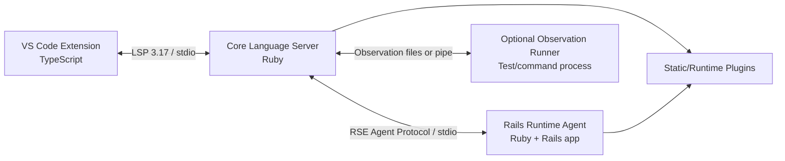
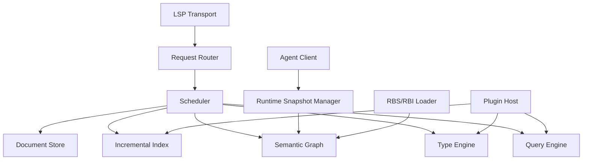

# 02. Architecture

## 1. 結論

推奨構成は4層である。



### VS Code Extension

- プロセス起動
- LSP client
- workspace trust
- status UI
- commands
- settings
- logs

解析ロジックを持たせない。

### Core Language Server

- LSP endpoint
- document store
- Prism parsing
- incremental index
- semantic graph
- type inference
- request scheduling
- cache
- Rails snapshot merge
- plugin host

### Rails Runtime Agent

- `bin/rails runner`で起動
- Rails applicationのboot
- routes、models、schema、associations等の抽出
- reload
- Runtime plugins
- DB connection cleanup

### Observation Runner

- opt-in
- testまたは任意コマンドを別プロセスで実行
- workspace内メソッドの引数型・戻り値型を収集
- 値は記録しない
- 推論の根拠ではなく補助evidenceとして扱う

## 2. なぜVS Code拡張内に解析器を置かないか

- Extension HostのCPU・メモリを圧迫する。
- Ruby環境、Bundler、Rails bootとNode.jsを混在させる必要が生じる。
- VS Code以外への展開が困難になる。
- クラッシュ境界がなくなる。
- 公式VS CodeのLanguage Server構成も、clientとserverを別プロセスにすることを前提としている。

## 3. なぜCore ServerとRails Agentを分けるか

Rails bootは任意のアプリケーションコードを実行する。initializer、DB接続、外部サービス、ファイル監視、子プロセスなどがCore Serverの安定性を破壊し得る。

分離によって次を得る。

- Rails Agentが落ちても静的解析を継続できる。
- Agentだけを再起動できる。
- Railsのstdout汚染を隔離できる。
- Ruby/Railsバージョン差を境界内に閉じ込められる。
- 将来、複数environmentやengineに別Agentを割り当てられる。

## 4. Ruby LSPアドオンを基盤にしない理由

Ruby LSPのアドオンは、既存LSPに機能を追加する用途には優れている。しかし本製品は次を中核にする。

- 独自type lattice
- inter-procedural inference
- semantic graph
- confidence付き複数evidence統合
- custom request scheduling
- Runtime Snapshotの世代管理

Ruby LSPのアドオンAPIは現在も変更可能性があり、既存のmethod resolution方針を置換する用途には向かない。アドオンとして試作すると、最終的にCore Serverを書き直す可能性が高い。

したがって、Prism、RBS、Ruby LSP Railsのプロセス分離手法、Ruby LSPのindex設計は参考・必要に応じて再利用するが、製品境界は独立させる。

## 5. プロセス構成

### 単一workspace folder

```text
VS Code Extension Host
└── ovallsp-core (project Ruby + composed bundle)
    └── bin/rails runner .../runtime_agent.rb start
```

### multi-root workspace

MVPではworkspace folderごとにCore Serverを起動する。異なるRuby/Bundler環境を1プロセスで扱わない。

```text
Extension
├── Core A -> Rails Agent A
└── Core B -> Rails Agent B
```

## 6. Bundle戦略

Core ServerはプロジェクトのGemfileへ直接gem追加を要求しない。

推奨:

```text
.ovallsp/
├── Gemfile
├── Gemfile.lock
└── cache/
```

composed bundleはCore Server自身のgemと、対象プロジェクトのbundleを共存させる。Runtime Agentは原則として対象プロジェクトのbundle内で起動し、Agent用Rubyファイルは絶対パスからrequireする。

MVPでは環境差の複雑さを抑えるため、最初はプロジェクトGemfileへ開発用gemを追加する方式でもよい。ただし恒久仕様にしない。

## 7. Core Server内部構成



### Document Store

- URI
- current text
- LSP version
- parse result
- line index
- dirty state
- last indexed version

### Incremental Index

- constants
- classes/modules
- methods
- aliases
- includes/prepends
- attributes
- lexical scopes
- call sites
- DSL declarations

### Semantic Graph

node例:

- Class
- Module
- Method
- Variable
- Constant
- Route
- ModelColumn
- Association
- View
- ControllerAction
- Type

edge例:

- defines
- inherits
- includes
- prepends
- returns
- accepts
- calls
- generated_by
- resolves_to
- renders
- assigns_to_view
- has_column
- associates_to

### Type Engine

- constraint generation
- local flow analysis
- method summary calculation
- generic substitution
- union normalization
- nil narrowing
- fixed point
- widening

### Query Engine

LSP requestをsemantic queryへ変換する。

```text
completion(position)
hover(position)
definition(position)
references(position)
signature_help(position)
diagnostics(document)
```

## 8. スレッドモデル

Rubyプロセス内で無制限な並列解析は行わない。

推奨:

- main thread: transport and state mutation
- analysis worker pool: parse/inferenceの純粋計算
- agent reader thread: Runtime Agent messages
- cancellation tokenを全queryへ伝播

インデックスへのcommitは世代番号を確認してmain threadで行う。古いdocument versionの結果は破棄する。

## 9. 状態の世代管理

```text
workspace_generation
runtime_snapshot_generation
document_version
index_generation
```

すべてのquery resultは、どの世代から生成されたかを内部的に保持する。

- 未保存documentは常に最新のdocument versionを使う。
- runtime snapshotは保存済みファイルに対する補助情報として使う。
- Rails reload中も最後に成功したsnapshotを読む。
- reload成功時にgenerationを増やして影響範囲をinvalidateする。

## 10. 障害分離

| 障害 | 動作 |
|---|---|
| Prism parse error | error-tolerant ASTで可能な範囲を継続 |
| Runtime Agent boot失敗 | static-only mode |
| DB接続失敗 | routes等のDB非依存snapshotを維持 |
| Agent protocol破損 | Agent終了・再起動、Core継続 |
| plugin例外 | plugin単位で無効化 |
| type inference timeout | Unknownへwidenしqueryを返す |
| stale response | generation不一致なら破棄 |

## 11. セキュリティ境界

Rails Agentの起動はworkspace内コードの実行である。

- VS Code Workspace Trustがない場合、AgentとObservation Runnerを起動しない。
- Coreの静的解析は継続する。
- ネットワークポートを開かない。
- stdio子プロセスのみを既定とする。
- observationでは値、文字列、SQL、環境変数を保存しない。
- ログからcredentialsらしき内容を除去する。
- project root外へのplugin探索を既定で行わない。
