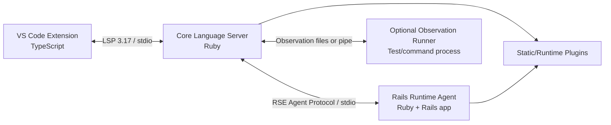
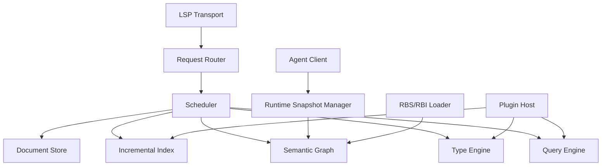

# 02. Architecture

## 1. 結論

推奨構成は4層である。



### VS Code Extension

- プロセス起動
- LSP client
- workspace trust
- status UI
- commands
- settings
- logs

解析ロジックを持たせない。

### Core Language Server

- LSP endpoint
- document store
- Prism parsing
- incremental index
- semantic graph
- type inference
- request scheduling
- cache
- Rails snapshot merge
- plugin host

### Rails Runtime Agent

- `bin/rails runner`で起動
- Rails applicationのboot
- routes、models、schema、associations等の抽出
- reload
- Runtime plugins
- DB connection cleanup

### Observation Runner

- opt-in
- testまたは任意コマンドを別プロセスで実行
- workspace内メソッドの引数型・戻り値型を収集
- 値は記録しない
- 推論の根拠ではなく補助evidenceとして扱う

## 2. なぜVS Code拡張内に解析器を置かないか

- Extension HostのCPU・メモリを圧迫する。
- Ruby環境、Bundler、Rails bootとNode.jsを混在させる必要が生じる。
- VS Code以外への展開が困難になる。
- クラッシュ境界がなくなる。
- 公式VS CodeのLanguage Server構成も、clientとserverを別プロセスにすることを前提としている。

## 3. なぜCore ServerとRails Agentを分けるか

Rails bootは任意のアプリケーションコードを実行する。initializer、DB接続、外部サービス、ファイル監視、子プロセスなどがCore Serverの安定性を破壊し得る。

分離によって次を得る。

- Rails Agentが落ちても静的解析を継続できる。
- Agentだけを再起動できる。
- Railsのstdout汚染を隔離できる。
- Ruby/Railsバージョン差を境界内に閉じ込められる。
- 将来、複数environmentやengineに別Agentを割り当てられる。

## 4. Ruby LSPアドオンを基盤にしない理由

Ruby LSPのアドオンは、既存LSPに機能を追加する用途には優れている。しかし本製品は次を中核にする。

- 独自type lattice
- inter-procedural inference
- semantic graph
- confidence付き複数evidence統合
- custom request scheduling
- Runtime Snapshotの世代管理

Ruby LSPのアドオンAPIは現在も変更可能性があり、既存のmethod resolution方針を置換する用途には向かない。アドオンとして試作すると、最終的にCore Serverを書き直す可能性が高い。

したがって、Prism、RBS、Ruby LSP Railsのプロセス分離手法、Ruby LSPのindex設計は参考・必要に応じて再利用するが、製品境界は独立させる。

## 5. プロセス構成

### 単一workspace folder

```text
VS Code Extension Host
└── ovallsp-core (project Ruby + composed bundle)
    └── bin/rails runner .../runtime_agent.rb start
```

### multi-root workspace

MVPではworkspace folderごとにCore Serverを起動する。異なるRuby/Bundler環境を1プロセスで扱わない。

```text
Extension
├── Core A -> Rails Agent A
└── Core B -> Rails Agent B
```

## 6. Bundle戦略

Core ServerはプロジェクトのGemfileへ直接gem追加を要求しない。

推奨:

```text
.ovallsp/
├── Gemfile
├── Gemfile.lock
└── cache/
```

composed bundleはCore Server自身のgemと、対象プロジェクトのbundleを共存させる。Runtime Agentは原則として対象プロジェクトのbundle内で起動し、Agent用Rubyファイルは絶対パスからrequireする。

MVPでは環境差の複雑さを抑えるため、最初はプロジェクトGemfileへ開発用gemを追加する方式でもよい。ただし恒久仕様にしない。

## 7. Core Server内部構成



### Document Store

- URI
- current text
- LSP version
- parse result
- line index
- dirty state
- last indexed version

### Incremental Index

- constants
- classes/modules
- methods
- aliases
- includes/prepends
- attributes
- lexical scopes
- call sites
- DSL declarations

### Semantic Graph

node例:

- Class
- Module
- Method
- Variable
- Constant
- Route
- ModelColumn
- Association
- View
- ControllerAction
- Type

edge例:

- defines
- inherits
- includes
- prepends
- returns
- accepts
- calls
- generated_by
- resolves_to
- renders
- assigns_to_view
- has_column
- associates_to

### Type Engine

- constraint generation
- local flow analysis
- method summary calculation
- generic substitution
- union normalization
- nil narrowing
- fixed point
- widening

### Query Engine

LSP requestをsemantic queryへ変換する。

```text
completion(position)
hover(position)
definition(position)
references(position)
signature_help(position)
diagnostics(document)
```

## 8. スレッドモデル

Rubyプロセス内で無制限な並列解析は行わない。

### 実際のスレッド所有関係（0.2.7 で記述を実装に合わせた）

**この節は 0.2.7 まで実装と食い違っていました。** 「インデックスへの
commit は main thread で行う」と書かれていましたが、HEAD は背景スレッド
から `@index_mutation_mutex` の下で commit しています（cold index、
workspace pass、changed-files batch）。`document_store.rb` はこの節を自身
のスレッド安全性の根拠として引用していたので、食い違いは一箇所では済んで
いませんでした。以下は規範ではなく、実装の記述です。

| スレッド | 所有するもの |
|---|---|
| dispatch（transport） | LSP フレームの読み書き、`DocumentStore` への書き込み、didOpen/didChange/didClose の処理 |
| cold index | ワークスペース走査と、`@index_mutation_mutex` 下でのインデックス commit |
| workspace pass | 開いていないファイルの解析と publish |
| changed-files batch | ファイル監視イベントの取り込みと再インデックス |
| Runtime Agent reader | Agent からのメッセージ受信 |
| Agent refresh / restart | ルート・モデルの再取得と、その後の全開きファイル再 publish。`024.56` の並びを生むのはこのスレッドです |
| ancestry question worker | 静的に判定できない祖先について Agent へ問い合わせる |
| cache prune | 起動時のキャッシュ世代掃除 |

**共有状態に触るものは、以下の順序でロックを取ります。** どこにも書かれて
いませんでした（順序の逆転は発見されていません — 真実の情報源が2つある状態
であって、生きた deadlock ではありません）。`Server` が持つ9つと、各 store
が内部に持つものの関係です:

```text
agent_refresh → agent_restart → index_mutation → 各 store の内部ロック
                index_mutation → reference_state
                reference_rebuild → reference_state
publish_state は葉。外側へ入れ子にしません（FramedWriter の frame mutex を
除く。これは publish_state の内側で取られます）
読み取り時: HierarchyIndex → WorkspaceIndex
```

`workspace_pass` / `refresh_state` / `agent_retry` は短い状態更新のみを
守り、他のロックを保持したまま取ることはありません。

**この節が最初に書かれたとき、「27 箇所の `Mutex.new` が個別にこの順序を
守っていた」と書いていました。** `core/lib` には現在 30 箇所あり
<!-- measured: mutex-sites = 30 -->、上の順序が名指ししていたのは
`Server` の 9 つのうち 3 つだけでした。全体の棚卸しに読めて、実際は一部の
棚卸しだったことになります。実装と食い違わなくなったことを目的に掲げた節が、
その初出で数を間違えていた — レビューラウンドが指摘しました。

この数には印が付いており、`core/spec/meta/measured_claims_spec.rb` が
ツリーから数え直して照合します。手で書いた数が三度続けて再導出に耐えなかった
ため、覚えておくのをやめて検査させることにしました。

**文書は不変のスナップショットです。** `TextDocument` は構築時に本文・
版数・行オフセット・`buffer_id` を一緒に確定させて凍結し、
`DocumentStore#change` は新しいインスタンスを作ってハッシュのエントリを
差し替えます。背景スレッドの読み手は、
古い文書か新しい文書のどちらかを丸ごと見ます。0.2.7 まではその場で書き換えて
いたため、途中の状態を読めました — 実測で `position_to_byte_offset` の
1,977,451 回中 1,977,450 回が、どちらの文書のものでもないオフセットを返して
います（029 の M-2）。

**`buffer_id` はどのバッファのスナップショットかを表し、`#with_*` を通じて
編集の先へ引き継がれます。** 新しい id が振られるのは文書をゼロから構築した
ときだけで、それはファイルを開くか、ディスクから読むかのどちらかです。これを
発行する採番カウンタが、上の 30 箇所のうちの1つ（`TextDocument` のクラス
mutex)であり、他のどのロックの内側でも外側でもありません — 整数を1つ進める
だけで、その間に他を取ることがないためです。

版数はクライアントが決める値で、**1つのバッファの中でしか意味を持ちません**。
閉じて開き直したクライアントはどこから振り直しても構わないため、`024.56` の
規則(開いているバッファの版数より上は refuse)は下向きに振り直した場合しか
捕まえられません。上向きは同じ欠陥の裏返しで、整数同士の比較では原理的に
見えない — 比較している2つが同じ尺度に載っていないからです。どのバッファの
ものかを持ち歩くことが、版数を比較可能にしています（037 の C3）。

クライアントが版数をどう扱うかについては `docs/CLIENT_BEHAVIOUR.md` を
参照してください。**この段落は最初、そこに書かれている事実と反対のことを
主張していました** — しかも、その主張を1箇所に集約するために作った文書と
同じ変更で書かれたものです。`client_behaviour_spec` はそれを見つけられません
でした。走査が `docs/*.md` に限られていて `docs/design/docs/` を含まず、
正規表現も英語表現しか見ていなかったためです。両方直しました。

**診断の publish は一つの funnel を通ります。** `Server#publish_findings`
が uri ごとに最後に送った版数を覚え、古い版数の publish を落とし、clear は
常に勝って記憶を消します。版数付きの publish は、そのバッファがまだ開いて
いることを要求します — 閉じたファイルに対して `[findings, clear, findings]`
が飛ぶ `024.56` の並びは、これで塞がります（029 の M-3）。

古い document version の結果は破棄します。

## 9. 状態の世代管理

```text
workspace_generation
runtime_snapshot_generation
document_version
index_generation
```

すべてのquery resultは、どの世代から生成されたかを内部的に保持する。

- 未保存documentは常に最新のdocument versionを使う。
- runtime snapshotは保存済みファイルに対する補助情報として使う。
- Rails reload中も最後に成功したsnapshotを読む。
- reload成功時にgenerationを増やして影響範囲をinvalidateする。

## 10. 障害分離

| 障害 | 動作 |
|---|---|
| Prism parse error | error-tolerant ASTで可能な範囲を継続 |
| Runtime Agent boot失敗 | static-only mode |
| DB接続失敗 | routes等のDB非依存snapshotを維持 |
| Agent protocol破損 | Agent終了・再起動、Core継続 |
| plugin例外 | plugin単位で無効化 |
| type inference timeout | Unknownへwidenしqueryを返す |
| stale response | generation不一致なら破棄 |

## 11. セキュリティ境界

Rails Agentの起動はworkspace内コードの実行である。

- VS Code Workspace Trustがない場合、AgentとObservation Runnerを起動しない。
- Coreの静的解析は継続する。
- ネットワークポートを開かない。
- stdio子プロセスのみを既定とする。
- observationでは値、文字列、SQL、環境変数を保存しない。
- ログからcredentialsらしき内容を除去する。
- project root外へのplugin探索を既定で行わない。
