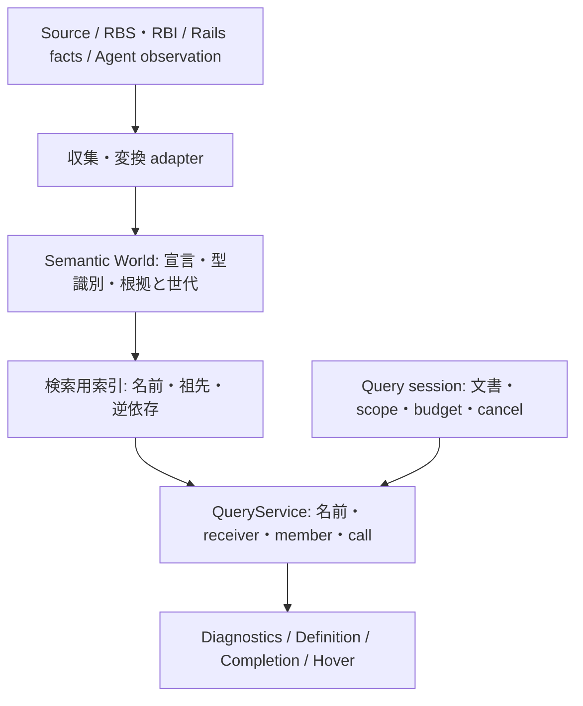

# 0.3.5 — what this release is for

**Branch:** `release/0.3.5`, merging into `main` by pull request.

## Why this release exists

0.3.5 の第一目標は、開発基盤・運用・テスト Tiering・高速化・ツール修復を完了し、パッチリリースを出荷すること。ドキュメントのAI協働向け削減・最適化、および機能本来の目標に基づく統合・コードベース削減を推進する。

## 1. エグゼクティブサマリ

**0.3.5 の第一目標は、開発基盤・運用・テスト Tiering・高速化・ツール修復を完了し、パッチリリースを出荷すること。Ruby を維持し、全面再実装は行わない。** 既存の型チェック保証の修復も試みるが、`024.224` の意味論変更は独立して取り消せる条件付き作業とし、3.2 の撤退後もリリース完遂（ユーザー要件4）へ進む。

出荷までに満たす成果は次のとおり。

- Unit/Core の反復は、5.2 の固定環境で全 Unit の中央値 3.0 秒以下を目標とする。既存の `# perf-guard:` 例外機構に従う性能評価として扱い、types/index の短い抜粋を Unit 全体と呼ぶことで達成扱いにしない。
- 同じテスト集合を実行する Core full suite の中央値を、正常完走 baseline の 50% 以下にすることを必達とする。絶対秒数は baseline 測定と manifest 確定後に決める。preflight 内の重い suite の二重実行をなくす。
- テストを要求する変更、必要な証明、実行する Tier、レビューの終了条件を文書と runner の双方で固定する。
- **文書の保守対象を減らす。** 2.5 の削除表に従い、目的・不変条件・check とその限界を正本文書に一度だけ置く。事故の再説明、手書きのコマンド複製、完了履歴の再掲を削る。AI が読む現役文書を薄くし、再現・判断の出所は参照で辿れる状態にする。
- `issues.rb promote` の可変位置指定を解消し、課題を取り違えずに処理できるようにする。関連する既知の運用ツール欠陥も再現・処置する。
- `024.224` は修正を試み、確定した型の識別情報と正しい不一致診断を守る。意味論の連鎖的退行が出た場合は 3.2 に従い thread を撤回し、再現・根本原因・後続 target を正式記録して open のまま送る。修正成功を出荷の必須条件にしない。
- `024.322` の外部 gem RBS 有効化は 0.4.0 に残す。今回必須なのは、その範囲・前提・受入条件を確定し、動いているという誤説明をなくすこと。閉鎖した扱いにはしない。
- 個人情報・ホームパス・PAT が公開される経路を配布物まで検査する。native extension の記録済み `LC_LOAD_DYLIB` 例外は実機検査で依存パスと個人情報を区別し、安全な解消法を確認できた場合だけ変更する。ユーザー固有ホームパスの実漏出と検査未実施は出荷不可とする。
- **共通基盤への移行は旧実装の削除までを成果とする。** 2.7 の負債索引を、2.8 の「目的→共通の判断→削除する処理」に接続する。0.3.5 は既存 API を使う安全な共通化、0.4.0 からは名前・呼出し・推論・状態の順で統合する。新しい facade を重ねただけで削減済みとしない。
- `scripts/release.rb` で公開し、Marketplace から取得した配布物と検証済み VSIX の SHA-256 一致、記録、タグ、PR 統合まで完了する。

**言語変更の判断:** 0.3.5、および 1.0.0 に到達するための基本方針は Ruby 継続。調査報告にある約 6 万行のテストは移植費用の大きさを示すが、すべてのテストの証明力を保証するものではない。Prism のパース時間、既存のインデックス処理のプロファイル、ロック待ちの測定は、現時点で全面 Rust 化を選ぶ根拠にならない。まず識別情報の再生成、重複探索、状態の所有と待ち時間を直す。

将来の native 化は、Ruby 内部の重複処理と不要な待ちを取り除いた後も、同じ入力・品質条件で CPU 支配の特定処理が予算を外れる場合だけ検討する。LSP のプロセス境界は差し替え実験を容易にするが、Ruby 内部 API に結び付いたテストの自動移植を意味しない。全体置換の予定日や採用言語は今は決めない。

Section 0.4 が日常的誤答を明記している対象は 1.0.0 の成立条件である。本計画では別途、0.3.5 で新しく導入する日常的誤答と安全性の退行を出荷不可とする。既存の全バックログを、根拠なくこのパッチのブロッカーへ変換しない。

## 2. 22 領域の横断整理と方針

### 2.1 領域ごとの処置

| 領域 | 0.3.5 での処置 | 後続への境界・受入条件 |
|---|---|---|
| 01 製品成立条件 | 型チェックと未定義メソッド検出を修正の優先軸とする。新しい設定・コマンド・matrix row を追加しない | 0.4.0 の三公約と 1.0.0 の成立条件を維持 |
| 02 基準点・残課題 | fetch 後の SHA・タグ・最新 task・台帳を再照合。各 intake を再現、重複、非再現、修正、後続へ処置 | 旧課題の target だけを見て一括移動しない |
| 03 Parser・位置 | owner・singleton・定数宣言の報告を Ruby 実行と本番経路で再現。既存保証の誤答なら最小の宣言生成箇所で修正 | Cref 全 API 再設計は今回必須にしない。ERB の位置対応は既存保証として Unicode 対照を維持 |
| 04 型・推論 | `024.224` の識別情報保持と比較の修復を試行。Nominal、Generic、Union、戻り値の読者を棚卸し | 3.2 の撤退条件を適用。case/loop/rescue/多重代入、MethodAnalyzer の広範な推論拡張、Unknown 理由の全面型付けは 0.4.0 の設計判断から 1.0.0 へ |
| 05 名前・メソッド解決 | `024.224` が必要とする確定型と推測の区別を維持。曖昧な bare name を確定型に昇格させない | D1/D3 全域導入、対話機能への availability 一律適用は 0.4.0 で再現別に判断 |
| 06 RBS・gem | project sig/RBI と RBS 型比較を検証。`024.322` は未提供の到達経路と依存条件を確定 | gem RBS の本番有効化、`024.321` の診断根拠拡張は 0.4.0。新しい解析対象をパッチで暗黙に増やさない |
| 07 Rails・観測 | Agent 不在、DB 停止、非 Rails、観測失敗時の既存フォールバックを回帰検証 | 新しい DSL や観測項目は追加しない |
| 08 診断方針 | shipped path が safe になる事実を記録。設定・mode の到達可能性をコードから確認 | severity、mode の関係は 0.4.0 の先行決定。safe を standard に変更しない |
| 09 LSP 機能間 | 型識別修正に対する hover/completion/definition/diagnostics の同一入力対照を実施 | activeParameter は現行 Task 061 では未提供。調査報告の「一部実装が粗い」を修正着手の根拠にしない |
| 10 状態・並行性 | aliases のロック境界、callee 本文変更後の caller 更新を再現。必要な所有・失効箇所を修正 | 粗大ロックを単に外さない。LocalInferencer の共有だけで競合と断定せず、呼出経路の排他を調べる |
| 11 性能 | suite 性能と製品レイテンシを別計測。既存キャッシュの重複探索・識別子再生成を減らす | `024.45` の 300 ms 達成とは区別。完全な増分解析・世代 snapshot は 0.4.0 の別作業 |
| 12 責務・保守 | 2.7 の負債表を 2.8 の統合先と削除対象へ接続。候補の再探索と意味を持たない表記変換から共通化 | 名前・呼出し・推論の判断を集約し、旧経路を撤去。収集元固有の処理は保持する |
| 13 起動・環境 | 依存不足、アクセス拒否、boot 失敗、製品不具合を別の結果にする。再起動と静的縮退を維持 | E2E をモックに置き換えて起動できたとは報告しない |
| 14 安全・privacy | tree、履歴、メッセージ、ログ、展開済み VSIX、native binary を検査。実行・削除境界を維持 | 検査未実行または漏出が残る場合は出荷不可 |
| 15 テストの証明力 | Tier、oracle、対照、mutation、skip の意味を明文化。runner 自身の偽 green を壊すテストを追加 | 行数・件数だけを品質指標にしない |
| 16 再現可能な環境 | Ruby/Bundler/Node/lock/fixture を固定。サンドボックス用の独立 fixture 準備を実装 | 外部依存にアクセスできない実行は環境未成立。release full の PASS には使わない |
| 17 規則・レビュー | AGENTS は入口、詳細は目的・不変条件・checks に圧縮。Test-First の適用範囲を明確化 | レビューの三回規則・独立性を維持し、その重複説明を削除。モデル更新時も保証と手順を分けて評価 |
| 18 課題・リリース | promote の安定識別と書込み整合性、関連 guard 修復。open/bump/gate/publish/record を使用 | `cut` という存在しない subcommand を手順に残さない |
| 19 advanced-workflow | Gemini が統合・単一書込・計測を所有。Brain が計画・設計、独立 reviewer が検証 | CLI が一度起動したことだけで協働成立としない。隔離・証跡・停止復帰まで確認 |
| 20 文書 | 2.5 の対象節を削除・圧縮し、規則ごとの正本を固定。公開説明は日英、内部文書は一言語 | 公開する構造化事実の生成を段階導入。CHANGELOG、KNOWN_LIMITATIONS、site の意味と公約を維持 |
| 21 到達可能性 | 削除済み plugin の古いコメントと実際の gem RBS 未到達経路を区別して整理 | plugin 機構を復活させない。動かないコードのコメント修正だけで機能修復としない |
| 22 再実装・言語 | Ruby 継続を ADR に残す。識別情報保持→探索再利用→状態所有の順で改修 | 将来は限定 native prototype を同じ意味論・実測条件で比較し、優位がなければ捨てる |

### 2.2 調査報告をそのまま採用しない箇所

- `preflight.rb` は full の後に real Rails、capability、client behaviour を再実行している。これは現行コードで確認できる重複。未知のリトライが多いという仮説とは分ける。
- `promote` は、位置番号が先行操作で変わることに加え、人間が古い番号を再使用すると読取り開始時点ですでに別項目を選べてしまう。intake に記録された R03/R13 の意図で R04/R06 が昇格した実害を再現する。同時編集防止や挿入オフセットの修正だけでは不十分で、一覧を選んだ時点の `--expect-title` または項目ダイジェストとの照合を必須にする。
- 調査報告の 19 failures と 100 pending は成功した full のベンチマークではない。EPERM の原ログが手元で確認できないため、単一原因が全件を説明するかも実行開始時に再確認する。
- 既存の性能記録は「SymbolId 構築・hash と二つの index 走査でおおむね半分」。文字列結合だけが 50% 超と狭めたり、すべてを最新 HEAD の profile と扱ったりしない。
- `performance.md` という入力中のパスは存在せず、手元には `docs/reviews/2026-09-05-critical-review/performance.rb` と `.json` がある。save-to-publish と hover 待ちの記録は `024.45` 本文にある。
- `QueryContext` の共有、Rails 判定、Redactor の存在だけから、全経路が安全・一貫・検証済みとは結論しない。今回触る境界の対照で確認する。

### 2.3 テスト規則と範囲

テストの境界は速度でなく責務で決める。遅い純粋計算を Integration と呼び替えて Unit の予算を満たしてはならない。

| Tier | 対象 | 禁止・分離 | 実行契機 |
|---|---|---|---|
| Unit/Core | 型値、既に構築された小さい index、純粋な比較・変換・選択。狭い依存だけを require | Rails/Agent/VS Code 起動、実 gem 探索、ネットワーク、全 repository 読込み、sleep を含めない | Test-First の反復、変更単位。合計 3 秒以内を目標 |
| Integration | Parser→Index→Resolver→Engine、実ファイルを使う script、git/tempdir/小さい RBS fixture、状態更新 | ユーザーの作業ツリー・cache・DB を変更しない。実 Rails/外部プロセスを使う群は別 shard | 関係経路の変更、preflight、CI |
| E2E | 実 LSP transport、実 Rails/Agent、VS Code host、packaged Core | 解析器や transport をモックして E2E と呼ばない。実行できない場合を PASS にしない | PR・release。変更経路の focused E2E は実装時にも実行 |
| Full | Unit + Integration + E2E + metadata guard の全対象 | Tier とは別の集約。全例を一度ずつ実行し、欠落・重複・非許可 pending を拒否 | 現行契約どおり preflight、CI、release gate |

Core full と、VS Code unit/host/packaged を含む全リリース検証は別の所要時間として報告する。Core が高速化した数字をリリース検証全体の数字として使わない。

既存の `core/spec/ovallsp` などを一括で移動せず、metadata/manifest で分類する。各 spec file を原則一 Tier とし、混在ファイルだけ分離する。各 spec は必ず一つの Tier、実資源の要否、並列実行可否を持つ。manifest の漏れは CI エラーとする。既存の例の選択名や pinned mutation の参照を移行で失わない。

| 変更の種類 | 必須の証明 | 追加しないもの |
|---|---|---|
| 誤診断・型・解決 | 本番につながる経路の再現を先に red、正しい診断を守る陽性対照、必要な Unit、独立期待値 | 実装をそのままなぞる期待値、false positive が消えただけの合格 |
| 状態・並行性・cache | 古い世代、更新、取消、再オープン等の競合順序を barrier/queue で固定して再現 | sleep で偶然競合させる証明、ロック有無の文字列検査だけ |
| 課題・release・検査 script | temp repository/fixture を使う CLI 入出力・失敗時の非変更・復旧。検査対象を植える陽性対照 | 正規表現が含まれているだけのテスト |
| 性能 | 同一入力の before/after、機構の重複処理を検出する決定的テスト、品質対照。時間上限を spec で課す場合は既存の `# perf-guard: <why>` を記す | 動作の正しさを短い wall-clock 上限で代用する assertion、固定 sleep 依存 |
| 動作不変の refactor | 既存の関連テストと差分評価。欠落保証があれば先に characteristic test | refactor のためだけの人工的 red。単なる構造変更に偽の障害を作らない |
| 誤字・説明・リンク | doc guards、日英の意味・公約確認 | 可逆な散文変更ごとの新規 unit test |
| 公開する機能追加 | minor にルーティング | 0.3.5 に便乗させる capability test と実装 |

Test-First は新しい動作と欠陥修正に適用し、oracle を決め、元コードで意図した assertion が失敗することを観察してから直す。load error、依存不足、fixture 準備失敗はその red の代用にならない。Ruby の期待値には実行セッション、外部 client/LSP の期待値には CLIENT_BEHAVIOUR の根拠、測定値にはデータと deriver を付ける。

mutation は判断を区別すると主張する example に結び付ける。hunk sweep の green は調査の入口であり、コメント行まで一律に欠陥扱いしない。特に「追加 spec を削除して suite が green」は、当該 spec に検出力がない証明にはならない。テストが消えれば検査も消えるためである。この解釈を簡単な defect/対照で再現し、該当 checker と文書の誤った判定を修正する。元実装への回帰または named mutation に対して残るテストが落ちるかで証明する。

pending は理由・対象・許可を照合する。既存 NOT YET だけを matrix と対応させて許可し、任意の理由文に NOT YET を含めれば通る運用をやめる。依存不足・EPERM・タグ不足による pending は release full では不合格とする。source archive 等の限定実行は別ラベルで報告できるが、release の証拠に流用しない。

### 2.4 full suite 高速化と環境整備

**順序は、重複削除→fixture 隔離→不要待ちの削除→負荷分散。** 同じ runner の worker が並列に動くことと、比較対象の before/after を同時に走らせることは異なる。測定は一回ずつ前景で行う。

1. full の一回の実行で progress と JSON を同時に出し、既存 `check_suites_ran.rb` にその JSON を渡す。preflight の二回目の Rails 等の RSpec 起動をなくす。
2. `spec_helper` の全 Core eager load と support 全読みを分解。Unit は狭い require の helper を使用し、Integration/E2E は実 `AnalysisStack.build` を維持する。全 helper が共有する最小の初期化層に、`ENV["XDG_CACHE_HOME"]` のプロセス毎 tmpdir 退避、終了時 cleanup、`ExampleTmpdir` の include と `config.after { remove_example_tmpdirs }` を置く。これは Core の require より先に実行し、新 Unit helper からも必ず読む。fork を使う worker でも親の cache dir を継承して共有しない。`cache_isolation_spec` と `tmpdir_hygiene_spec` の対象を維持し、Unit だけの新規プロセス・失敗 example・複数 worker で cache/tmpdir の隔離と cleanup を確認する。
3. real Rails fixture の Gemfile/lock/DB/生成物を worker ごとの `Dir.mktmpdir` に移す。現行 Integration が source fixture を共有し、E2E がコピーを持つ非対称を解消する。
4. Rails の lock/install は example の前提判定で毎回行う形から、独立した準備フェーズへ移す。Ruby/platform/Bundler/Gemfile/lock digest を cache key にする。変更不能な依存 cache と、変更する DB・アプリを区別する。
5. サンドボックス向けには事前に解決した fixture lock と依存を使う。Bundler/Socket の例外を捕捉して「利用可能」と返すこと、E2E の resolver をモックすることは禁止。BundleEnvironment の故障を別の環境問題に偽装しない独立 probe を維持する。
6. boot 待ち・ポーリング・リトライの呼出箇所と時間を profile する。固定 sleep は観測できる ready/終了通知に置き換える。実際に必要な backoff は残す。テスト失敗の自動再実行で green にする設定は導入しない。
7. Ruby の test 並列化は OS process を使う。最初は worker=2、同じ manifest で worker=1/2/4 を比較し、CPU/RSS/時間から既定値を選ぶ。GVL を回避できると未検証の thread 並列化を選ばない。
8. shard は前回の file 別所要時間で均等化する。Rails/VS Code は lifecycle と共有資源の境界で分け、分割不能な群は一つの shard に置く。mutation/hunk sweep は別作業ツリーで直列実行する。
9. **全集合の証明と counts 導出を集約側へ移す。** sharding すると既存 `documented_counts_spec` が部分実行と判断して pending になるため、`documented_counts.rb` の導出を集約側で一度実行する。全 spec を読む独立した dry-run census と manifest の例 ID を照合し、部分 report だけから全集合を自己定義しない。CI の must-run guard、移動した check の manifest と結果の扱いも同時に移行する。移行前の pending は免除せず、通常の focused run は release full の証拠に使わない。
10. **上記の移行が green になってから集約 gate を適用する。** JSON 集約は expected example ID 集合、worker 終了、重複、欠落、load error、failure、pending と counts 導出結果を検査する。count の一致だけでは通さない。run ID、tree digest、runtime/lock digest、seed、worker 数を記録する。全集合証明→導出実行→集約 gate→preflight/CI 切替の順を守る。

まずは preflight が full を一度実行する契約を維持する。3 秒の Unit を full の代わりにして commit を通す変更は行わない。高速化後も残る不必要な反復は、検証範囲を確実に同定できる場合だけ次に減らす。本計画では曖昧な成功キャッシュを導入しない。

### 2.5 開発ルールと advanced-workflow

**文書を「AI に全手順を復唱させる台本」から、判断と検証の契約へ変える。** Astra／Fable 5.1／Gemini の推論能力は、証拠から手段を選ぶために使う。能力向上だけを根拠に oracle、独立レビュー、実機検証を不要とはしない。Section 0 を保持し、派生規則は同節 0.6 に従って削除・変更できる。

正本は既存文書を使い、別の巨大な INVARIANTS 文書やモデル別ルール集を新設しない。各正本の現役部分は **目的／不変条件／Checks（実行入口・証拠・検出限界）** で構成する。check のない判断はその旨と判断の出所を明示する。例外に不可欠な反例は一つ残し、事故の経緯は既存 task／entry／ADR への参照に縮める。AGENTS は目的の要約と作業に応じた読取先を持つ入口に留める。

#### 0.3.5 で削除・圧縮する現役記述

| 対象・確認した節 | 削除・統合する内容 | 残す正本・条件 |
|---|---|---|
| `docs/CODE_DISCIPLINE.md` — Test first、Unpinned behaviour、Code that deletes、The simplest thing | 失敗した過去セッションの再説明と他文書の corpus／sweep 手順。2.3 の変更別適用表に統合 | oracle・削除の包含・rescue verdict・判断を区別する mutation と限界。`038`、`027`、`048` は根拠への参照として残す |
| `docs/MEASURING.md` — Before reading any comparison、A green suite、Sweeps | 各失敗の物語と繰り返す確認命令を、入力・revision・完走・対照・隔離の証拠表へ圧縮。sweep の起動手順は DEVELOPMENT に一本化 | 前景で一測定、同じ corpus、本番 wiring、失敗と未実行の区別。5.2 の性能 contract をここへ置く |
| `docs/DEVELOPMENT.md` — Before committing/pushing、Cutting a release、Edits that lose work | gate の事故説明、PUBLISHING と重なる release 順序説明、消失事故の再話を削る | setup/test の実コマンド、`preflight --list`、release の `status` と PUBLISHING への参照、無関係な作業を失わない条件。preflight の実行義務は維持 |
| `docs/DOCUMENTATION_MAP.md` — trigger table の長い履歴、The site is documentation 以下の重複節 | 各行の事故年表を削り、site の対応表と「何を比較し、何を比較しないか」を一つの coverage 表に統合 | 更新先、rule ID、check、非機械判断。`doc_triggers.yml` の when/then が機械対象の正本。独立した第二の trigger 定義は作らない |
| `docs/RELEASE_CHECKLIST.md` — Public distribution、次のアクション、gate の完了談 | 公開前／公開後の経緯、打消し線の完了項目、tool に吸収済みの手順の再実行指示を削る | 配布記録は RELEASE_ARTIFACTS、環境保証は SUPPORT_MATRIX、未完了作業は既存 entry に参照。gate #15 の native 制約・実機対照・未検証範囲は保持。独自の証拠がここにしかなければ参照先へ移してから削る |
| `docs/PUBLISHING.md` — Versioning、The steps、GitHub Releases | 同じ patch/minor 理由と公開権限の複数回の説明を、判断表と一つの工程表へ圧縮 | 版の意味・公開条件・credential 境界の正本。実行順序と `record` 後の commit、artifact 検証を保持。native 等の実機手順は CHECKLIST の該当行へ参照 |
| `docs/REVIEW_LOOP.md` — Cadence、same place、independent review | round を増やした事故の再話と AGENTS／本書にある規範の複製を削る | 終了・三回上限・同一箇所再発・中立 round・独立性の規範はここに一度だけ残す。旧計画の「変更対象外」は撤回するが、回数規則の不一致という旧仮説は採用しない |
| AGENTS と本計画 | 詳細文書と重なる操作説明、レビュー指摘への応答履歴、「旧 item」等の編集経緯、繰り返す公開コマンドを削る | AGENTS の root 要約・読取先、計画の今回固有の判断・変更点・合否。規範を移した後は計画から正本へ参照。release task の必須行は保持 |

この表は 0.3.5 の文書作業の範囲であり、今回の改訂で上記ファイルを削除済みという意味ではない。ファイル単位での即時廃止は要求しない。節と記述の削除がまず確実に減らせる単位である。参照される再現、interpreter session、測定の deriver、判断の理由、公開文書の日英ペアは、重複して見えるだけでは削除しない。

#### advanced-workflow が保持する最小の契約

| 不変条件 | 実行・証拠の所有 |
|---|---|
| 一つの差分に一つの統合 writer、同じ保存先に競合する writer を置かない | Gemini が統合 branch・台帳・release を所有。並行する実装は担当ファイルと worktree を分離。測定・mutation の tree と資源を隔離 |
| 設計判断とレビューの独立性が辿れる | Brain（Astra）が目的・依存・採否を記録。Fable 5.1 等の reviewer は固定 revision と独立した入力から検証。モデル名や同じ回答の多数決では独立性を証明しない |
| 会話が失われても再開でき、実行結果と計画を取り違えない | 最新 release task に revision、dirty 状態、差分／証拠の所在、未処理事項と次の操作を残す。tool が出せる結果は転記せず参照 |
| レビューは判断の質を検証し、手動で同じ検査を反復しない | REVIEW_LOOP を適用。まとまりごとに行い、毎コミット二人を必須化しない。三回上限は安全性・今回必須の成果を免除しない |

協働の確認は小さい既存欠陥を issue→red→修正→独立 review→統合→再実行まで通し、中断後に別 agent が保存された証拠で続行できること。定型の役割プロンプト全文や一時会話を新しい運用文書として保存し続けない。

#### その後のスリム化

0.4.0 では、同じ構造化事実を複数箇所で手編集している領域から生成へ移す。候補は `doc_triggers.yml` からの機械対象表、runner manifest からの Tier／check 一覧、`package.json` からの設定・コマンド表。既存 reader／generator を拡張し、生成物は編集禁止と再生成差分で検査する。文章の意味まで生成で保証したとはしない。

公開する capability・roadmap・support の表は、対応する正本と日英の意味を保持できる領域ごとに 1.0.0 までに生成を検討する。内部運用文書の削減と同時に公開情報を消さない。モデル／workflow 更新時は、代表変更で見落とし・再作業・読取文書量を比較し、同じ保証をより少ない規則と手順で保てた箇所だけ置換する。既存の証拠とコードからその都度選べる手段を、恒久的な儀式へ書き戻さない。削減の評価方法は 5.5 に集約する。

### 2.6 文書改訂前の機械読者の棚卸し

実装時は変更予定文・見出し・コマンドを読む箇所を検索し、関連 meta spec の基準結果を残す。下表は移行先を判断するための reader 索引。checker が古い散文を固定している場合も、守る不変条件と破れる対照を先に特定し、reader と文書を同時移行する。文字列の存続自体を製品保証と見なさない。

| 機械読者 | 保持・移行する契約 |
|---|---|
| `core/spec/meta/agents_card_spec.rb` | カードの行予算、`CLAUDE.md` の import 全文、`highest-numbered`、参照可能な task、索引文書の `AGENTS.md` section 宣言。散文の言換えにもこれらの読者がある |
| `core/spec/meta/doc_links_spec.rb` / `scripts/check_doc_links.rb` | repo-root の文書パス、相対 Markdown link、実ファイルとの一致、削除記録。将来ファイルを既存リンクとして書かない。section anchor の意味まで検証済みとはしない |
| `core/spec/meta/doc_triggers_spec.rb` / `scripts/check_doc_triggers.rb` | `docs/doc_triggers.yml` の when/then と DOCUMENTATION_MAP の rule ID。`release-procedure` は companion のどれかで機械的には通るが、本計画では PUBLISHING・RELEASE_CHECKLIST・DEVELOPMENT をすべて実変更に合わせる |
| `core/spec/meta/measured_claims_spec.rb` | `measured:` marker、deriver、revision、周辺の数値、`024.*` 引用先。今回の目標を実測値に見せず、将来の達成値は raw data と deriver から書く |
| `core/spec/meta/documented_counts_spec.rb` / `scripts/documented_counts.rb` | 文書別の count 抽出表、`RSpec.world` と全 spec の対応、部分実行の pending、CI の must-run。2.4 item 9 の先行移行が必要 |
| `core/spec/meta/task_findings_section_spec.rb` / `scripts/release.rb` | `## Step 1 実装記録（2026-09-06）

1A の既存変更を保持し、1B〜1D の実装を追加した。`core/spec/test_hygiene.rb`
が cache のプロセス隔離と ExampleTmpdir cleanup を所有する。Unit は
`core/spec/unit_spec_helper.rb` と対象の狭い require を使う。
`core/spec/tiers.json` は全 spec の Tier、資源、並列可否の正本であり、
新規ファイルの分類漏れを runner が拒否する。共有する rails_minimal fixture
の利用群は直列に固定した。

環境の check/prepare は実依存を独立に調べ、依存取得をテスト本体から
分離する。準備した Rails lock は Ruby/platform/Bundler/Gemfile/lock の
ダイジェストで再利用し、可変アプリ・DB は suite の一時領域へコピーする。
BundleEnvironment の破損を依存不足へ変換する probe は使わない。
呼出元の DATABASE_URL / PRIMARY_DATABASE_URL を継承すると、fixture が別DBに
テーブルを作ることを隔離した SQLite ファイルで再現した。fixture boot で
DB と Rails 環境を固定し、利用者の DB へ到達しないようにした。

runner は独立した dry-run census、各 worker の例 ID と終了状態、run ID、
source/runtime digest、summary と pending を検証する。worker の TMPDIR は
親が所有し、at_exit を通らない終了でも親が回収する。前回の file duration
は割当ての参考値だけに使い、成功キャッシュには使わない。文書件数の実検査は
集約側へ移した。直接 full RSpec を使う既存 CI の件数検査も維持している。
preflight は full を一度実行し、同じ JSON を検証する。

検証した経路は `core/spec/meta/test_runner_spec.rb`、cache/tmpdir hygiene、
関連する counts/record/site/changelog guards、Unit の serial/parallel、
real Rails 単独である。新規 runner の named mutations は個別に適用して
検出を確認した。helper 自身は mutation applier の対象外なので、別プロセスの
失敗例・fork・cleanup を駆動するメタテストで検証している。

初回 full の ID 集合には欠落・重複がなかった。fixture 移行で検出した
クラスメソッド参照と tmpdir の realpath 不一致は修正し、Rails 単独で再確認
した。CHANGELOG の作成中セクションを未公開と明記し、サイト検査が出荷済みと
読む状態を修正した。

**正常 full baseline と CI 切替は未完了。** この実行環境では `ps` が EPERM
となり、capability E2E の終了プロセス検査を実行できない。環境 check も
これを permission failure として報告する。また、既存の `024.13`、`024.19`、
`024.47`、`024.224` の pending は承認済み NOT YET/matrix 対応を持たないため、
新 runner は不合格にする。意味論を Step 1 に混ぜたり、pending を一括許可
したりして GREEN にしない。CI には fixture prepare と manifest 検査だけを接続した。
1D の移行条件が満たされるまでは CI の full 実行を集約 runner に切り替えず、
既存の full/skip/count guards を維持する。最新の実行結果は
`core/tmp/tests/full.json`、preflight の診断は `core/tmp/tests/preflight.log` に
保存する。これらは公開対象ではなく、source 変更後の古い report は verify が
拒否する。正常 baseline の取得と性能改善率の判定は、制限のない環境で残る。

セッション開始時の fetch は `.git/FETCH_HEAD` への書込みが禁止されて失敗した。
手元の release branch と本書で実装し、commit/push/release は行っていない。

## 残課題` と「未処理の指摘はこの文書ではなく `024` に書く」の行。`open` が生成する `**Branch:**` 行も保持する |
| `core/spec/meta/no_wall_clock_thresholds_spec.rb` | 時間の定数比較と `# perf-guard: <why>` の許可機構。Unit 3.0 秒を動作 assertion と混同せず、5.2 の性能評価として運用する |

### 2.7 実装の技術的負債・粗大箇所と記録先

現行コードの読取りで確認できた構造と、まだ実測・競合再現を要する疑いを分ける。下表は正式記録への索引であり、別の課題レジスタではない。既存 entry があるものは重複して promote しない。新たな誤動作を発見した場合だけ intake に追加し、再現と分類を終えてから安定 handle を使って昇格する。

| 箇所・具体的な負債 | 現時点で確認した構造／未確認の点 | 正式記録・次の処置 |
|---|---|---|
| `core/lib/ovallsp/server.rb` の責務集中 | `dispatch`、`publish_diagnostics` / `publish_findings`、`apply_file_summary`、`ensure_reference_index_current`、`reload_signatures`、`maybe_start_agent` が同じ Server の状態と lifecycle を扱う。責務の境界が長いクラス内部にあり、変更時の失効・起動・公開の読み合わせが広い。規模だけで誤答と断定しない | `docs/ISSUES.md` intake の「Server concentrates transport, analysis publication, invalidation and runtime lifecycle」は前回の計画改訂時に追加済み。呼出・書込み・lock の所有表を作り、callee/caller の既存 intake と照合。0.3.5 は触る境界だけ、独立した再編は再現・費用評価後にルーティング |
| `core/lib/ovallsp/index/symbol_id.rb` の文字列中心の識別 | `qualify_owner` の prefix 正規化、`qualify_within` の文字列結合、lookup 時の `SymbolId` 再生成と hash が調査対象。`qualify_owner` の memo はすでにあるため「毎回同じ文字列を新規作成する」とは言わない。最新の支配率は未測定 | 性能は既存 `024.45`、型の表示名と同一性は `024.47` / `024.224` が所有。構築・hash・split/to_s・保持量を分けて profile し、既存 memo の再利用と寿命を確認。型の全面変更は 3.2 の撤退対象 |
| `server.rb#with_index_snapshot` の粗大ロック | `dispatch` の対話要求と `publish_diagnostics` の解析が `@index_mutation_mutex` を共有する。index の整合性を守る一方、長い解析は要求待ちを生む。個別 index の mutex と lock order を合わせて見る必要がある | 既存 `024.45` / `024.137`。実 transport の待ちと CPU を分ける。0.3.5 は反復仕事の削減を先行し、ロック分割は世代・request state の所有保証後。aliases の排他漏れは既存 intake で別に再現 |
| `core/lib/ovallsp/local_inferencer.rb` の request state 共有 | `AnalysisStack.build` から渡される inferencer の `@steps`、`@step_budget`、`@self_type_stack`、`@scope_capture` 等を entry point で更新する。共有 instance の存在だけでは競合の証明にならず、現行 `dispatch` の排他を含む呼出経路を読む必要がある | 既存 `024.39`、環境コピーのコストは `024.38`。古い entry のロック非取得という説明を現行経路と再照合し、barrier で到達可能な重なりを固定する。未再現の競合を修正済みと報告しない |
| `core/spec/spec_helper.rb` と Rails fixture の準備集中 | 全 Core と support の eager load、source fixture を使う Integration とコピーする E2E の準備差、依存準備と test の混在。helper には安全に必須の cache/tmpdir cleanup も同居する | fixture は既存 `024.71`、0.3.5 の P02 が所有。2.4 に従い依存準備と軽量 require を分け、B1 の衛生層を全 helper に継承。境界を分ける際に解析器の本番 wiring を失わない |

棚卸しの完了条件は、各箇所について現行の呼出・状態所有・既存保証・再現または未再現・担当作業・後続 target が正式記録から辿れること。行数ランキングだけで終えず、未再現の構造上の懸念は intake に留める。リファクタリングを一律に defect として採番しない。

### 2.8 機能の達成目標から組み直す統合・削減設計

**統合する単位はクラス名や似たコードの形ではなく、同じ入力に対して同じ根拠で答える判断である。** 型チェックと未定義メソッド検出が製品の中核。定義ジャンプ・補完・hover は同じプログラムの意味を別の形で示す。各機能が独自に receiver・祖先・署名の優先順位を再構築する必要をなくすことが、大幅削減の中心になる。

#### 目的と、共有すべき回答

| 利用者が達成したいこと | 共通基盤が答えること | 機能側に残す判断 |
|---|---|---|
| 型の合わない引数・戻り値を見つける | receiver の同一性、到達するメソッド、overload と型代入、実引数・結果の型、その確実性 | 現行で提供する検査の範囲、診断を出せる根拠、mode／severity。戻り値の検査能力をこの表だけで提供済みにしない |
| 存在しないメソッド呼出しを見つける | メンバー集合と枝ごとの存在・完全性・可視性。不在を証明できる範囲 | safe mode の診断方針、range・文言。取得不能を不在へ変換しない |
| 呼出し先の定義へ移動する | 同じ候補の SymbolId と実在する宣言位置、生成元・署名位置 | 返す候補と LSP location。観測で存在だけ分かる候補に架空の位置を作らない |
| その場所で使える候補を補完し、型を確認する | 同じ receiver と呼出し文脈に対するメンバー・引数・型・条件付きである理由 | prefix、表示順、snippet、hover 文面。候補の表示可能性と診断の断定可能性は区別 |

#### 現行の分散箇所と統合先

以下の現存メソッドを読んで特定した構造上の削減候補。誤動作の再現済みリストや削減量の実測ではない。

| 現存する判断・状態 | 統合先と消すもの | 保持する相違・関連記録 |
|---|---|---|
| `WorkspaceIndex#resolve_type_name` / `#resolve_type_symbol` / `#nested_type_name` と `#guessed_type_name?`、`HierarchyIndex#canonical_name`、`GemIndex#resolve_simple_name`、`LocalInferencer#constant_type_name`、`ReceiverResolution#resolve_explicit_receiver_name` | 文脈付き名前解決を一つの入口にする。workspace/gem/signature の候補取得をその入口が組み立て、読者側の推測再判定・名前の再探索を順に削除 | lexical nesting、rooted reference、曖昧さ、署名が既知か取得不能かを区別。単なる `::` 除去とは別。D1、`024.47` / `024.224` |
| `QueryService#members_of` / `#signatures_of` / `#definitions_of`、`MethodResolver#resolve` / `#complete` / `#availability`、`Engine#rbs_resolves?` / `#declared_signature_for`、`LocalInferencer#resolve_signature_call` | 一つのメンバー探索と呼出し回答へ集約。祖先走査、同一候補の再解決、各読者の source/RBS/model fallback を削る | メンバーの存在、型契約、定義位置は別の情報。同じ global source priority で全部を上書きしない。D2/D3、`024.45` |
| `ReceiverResolution#receiver_type_for`、`Engine#receiver_type_for`、Server の `#receiver_type_before_dot` / `#enclosing_self_type` と view 初期環境の準備 | 同一の呼出し位置から Receiver を作る入口にする。機能側の self／view／定数 receiver の組立てを撤去 | カーソル直前・呼出しノード・ERB の元位置は入力 adapter で揃える。位置の包含規則は別問題。D3、`024.63` |
| `LocalInferencer#eval_type` / `#resolve_call` と `MethodAnalyzer#eval_node` / `#eval_call` | 共通の式・呼出し評価へ段階移行。メソッド解析側に残すのは summary の要求・依存・再帰制御、局所推論側には指定位置の環境取得 | 二つの評価器は現在、扱う構文・return・budget・生成宣言が異なる。一方への単純委譲で広い型を捨てない。D3/D6、`024.38` / `024.39` |
| `WorkspaceIndex` のファイル宣言と `HierarchyIndex` のファイル別 facts、Server の `#apply_file_summary` / `#invalidate_method_summaries`、`AnalysisStack#replace_file` / `#remove_file` | 宣言と更新の正本を一つにし、階層・逆参照・summary はそこから作る索引／派生値にする。per-file の二重所有と各読者へ通知する同期コードを削る | 同じ更新単位でも検索用索引は複数必要。物理的に一つの Hash に集めることは要求しない。`024.62`、Task 048、`024.45` |

既存の `AnalysisStack` は組立ての正本、`QueryService` は対話機能の入口、`Types.class_object_lookup` / `Types.base_nominal` は型の見方、`SymbolId` は表記の共有、`MemberAvailability` は present/absent/unknown を既に持つ。一方、`Index::TypeNameResolution` は置換判定の helper であり、D1 の根拠付き解決値が全域に実装済みという意味ではない。これらを拡張・置換し、並立する第二の semantic engine を追加しない。

#### 統合アーキテクチャ（目標形、名称は設計上の仮称）



**Semantic World は共有する意味モデルと読取り境界の名前であり、全機能を持つ巨大クラスではない。** `AnalysisStack` の wiring を唯一のまま保ち、既存 store を使うところから進める。parser、RBS loader、runtime の取得・信頼・破損処理は adapter に残す。`WorkspaceIndex` は宣言検索、`HierarchyIndex` は順序付き祖先の派生索引、`GemIndex` は Agent snapshot の adapter／view へ責務を絞る。gem 自身の名前解決 policy や各機能の祖先探索をそこに残さない。parser や RBS AST の全コピーを中間 DB に積み直す基盤は作らない。

| 契約（提案） | 保持する情報・禁止する情報喪失 |
|---|---|
| `resolve_name(reference, scope, world) → NameResolution` | reference の root 指定と nesting、候補ごとの完全修飾 identity、basis（宣言・nesting・祖先・推測等）、曖昧さ／取得不能の理由。確定型は再解決せず通す。`canonical_name` だけを返して basis を後から推定する API は移行完了時に撤去 |
| `receiver_at(site, session) → Receiver` | 型、名前解決の根拠、instance/class-object、implicit/explicit self、可視性を決める scope、view の初期環境、文書 identity。同じ構文位置を各機能が同じ入口で問い合わせる。差分編集途中の位置を無理に確定しない |
| `members(receiver, selector, session) → MemberSet` | exact name と prefix は同じ owner/member の読取りを使う。候補に SymbolId、lookup rank、visibility、由来、宣言位置、署名への参照を保持。完全性は owner・side・情報源・receiver の枝ごとに保持し、空集合だけから absent を作れなくする |
| `call(receiver, name, arguments, session) → CallResolution` | MemberSet に対し overload 選択と型代入を行う。結果型・依存・根拠・未解決理由を返す。型チェック、signature help、推論が同じメソッドを別々に選び直す処理をなくす |
| 共通の式評価（既存 inferencer を移行） | 値の型、環境、到達可能性、return 等の制御フロー、依存、budget 消費を扱う。summary とカーソル照会は同じ評価規則に対する用途。再帰打切り・timeout・unknown を確定した型や正常完了へ丸めない |

型の identity は表示文字列から復元しない。`Types` に nominal/generic/union/class-object の演算を集約し、`SymbolId` を保持できる箇所は保持する。外部署名しか知らない型に workspace の宣言位置や kind を捏造しない。型参照とメソッド等の SymbolId の関係は明示するが、全種類を一つの巨大 union に混ぜない。内部 `Relation` 等の型形状、Ruby の実クラス、nil を同じ名前列に平坦化しない。

**優先順位は情報の用途ごとに定義する。** source は宣言位置・実装、RBS/RBI は型契約、Rails／Agent は生成・実在の事実を供給する。同一 owner／side／member の情報を結合し、別 owner の同名候補を混ぜない。最寄りの呼出し候補と継承先の位置、own signature と inherited signature、独自 `new` と constructor fallback の区別を保持する。観測値は型契約を上書きせず根拠を残す。現行の違いを fixture で列挙し、不一致を直す必要がある箇所は refactor から切り離して課題として判定する。

**各機能の答えを同じ形式にする必要はない。** 共有するのは receiver identity、候補と根拠である。補完の conditional 候補、複数の定義位置、診断の断定条件を区別した projection を置く。Union の一枝でメソッドが見つかったことを全枝の呼出し成功としない。`unknown` を含む枝や未読の祖先があるとき、診断の可否はその枝に対する証明と現行方針で決める。共通化に伴って一律に全診断を黙らせたり、補完候補を落としたりしない。

**状態は workspace 所有と request 所有を分ける。** ファイル更新は受理済みの buffer identity/version と一緒に一箇所で commit し、依存する索引を失効させる。query は document、workspace、signature、runtime の整合した世代を捕捉し、計算途中の新旧混在と stale publish を拒否する。budget、cancel、self stack、局所環境は session に置く。`QueryContext` が世代値を持つことだけでは snapshot 保証にならないので、初期移行は既存 mutex の下で行い、読取りの一貫性を証明してからロックを狭める。全データの毎編集 deep copy、無制限の永続 memo、用途別の duplicate cache は採用しない。派生 cache の key は入力・意味に関係する世代・文脈を含め、古い世代の解放と memory の上限を測る。

#### 0.3.5 の足がかりと、以後の撤去順序

| 段階 | 実装する範囲 | 同じ変更単位で消す処理・採用条件 |
|---|---|---|
| U0 — 0.3.5、P11/P08 | `QueryService#add_source_members` が `MethodResolver#complete` の後に `#source_parameter_names` で各候補を再 resolve する経路を整理。resolver が選んだ候補の引数情報を同じ探索から渡す。別案として同一問合せ内で候補を再利用 | 再探索とそこだけの helper を削除。alias、継承、Union、可視性、gem の位置なし候補を対照にし、表示・snippet を維持。広い API 変更が必要なら当該案は撤回し、結果と理由を記録 |
| U0 — 0.3.5、P11 | 名前操作を「表記変換／lexical qualification／候補解決／表示」に分類。意味と nil／空文字／root 指定の契約が同じ箇所だけ、既存 `SymbolId` の関数へ委譲。既に委譲済みの `canonical_receiver_name` 等は削減実績に数えない | 独立した表記変換の複製を撤去。`HierarchyIndex#canonical_name` や `GemIndex#resolve_simple_name` は意味の判断なのでこの作業へ混ぜない。読み手に広い変更が必要なら後続へ |
| U0 — 0.3.5、P03/P11 | 呼出し・所有・削除先をこの対応表から実メソッドの参照一覧へ落とし、2.5 の文書削減を実施。P04 の採否を独立判定 | 新しい World／resolver facade の先行実装は不要。基盤整理は既存の型表現で完結させる。P04 撤退でも残せる共通化だけを採用 |
| U1 — 0.4.0 の設計・最初の縦断移行 | D1 と `024.224` の根拠付き identity を生産者から一つの query 経路へ通す。続いて D3 の Receiver 入力を共有。パッチで提供を変えられなかった箇所もここで分類 | 移行した範囲の `guessed_type_name?` 等の補償判定と機能側 receiver 組立てを削除。全 reader の一括改修を 0.4.0 の着手条件にしない |
| U2 — 0.4.0 から 1.0.0 までの次の移行 | MethodResolver と QueryService の member／call 回答を統一し、RBS・source・生成事実の結合を集約。gem RBS は 3.3 の受入後に同じ adapter 境界へ入れる | 各機能の RBS 再探索、祖先再走査、独自 fallback を撤去。`resolve/complete/availability` は共通回答の projection とし、独立した探索器でなくす |
| U3 — U2 の呼出し評価が成立後、1.0.0 まで | LocalInferencer と MethodAnalyzer の評価規則を共有。literal／local／call から進め、return・分岐の結果契約を揃えて一方の evaluator を退役 | 二重の Prism 評価分岐・型 join・呼出し heuristic を削除。`MethodAnalyzer` は summary 管理へ絞り、既存の構文対応と推論の広さを比較して維持 |
| U4 — 所有と世代の対照が成立した範囲から、1.0.0 まで | Semantic World の更新入口と派生索引を確立。workspace/hierarchy の per-file 正本を共有し、逆依存から summary と caller を無効化。U1/U2 と独立できる部分は先行可能 | 二重のファイル bookkeeping、世代を手で揃える通知、Server 内の解析組立てを撤去。検索用索引と収集 adapter は残す。CPU／待ち／RSS の実測後に snapshot 読取りへ移す |

U1〜U4 は内部設計の順序であり、新しい公開機能の公約ではない。0.4.0 の三公約を統合全面完成の後ろに置かない。実行開始時に、最新再現と頻度からその release で完結する slice を選び、残りを次の release task へ接続する。1.0.0 の採否は Section 0 の製品品質で決め、図の全箱が新クラスになったかでは決めない。

**「統合完了」は旧経路の退役を含む。** slice ごとに旧生産者・全読者・移行先・削除対象を記録し、characteristic test／必要な defect の red→既存 API 背後の移行→同一入力の比較→全読者切替→旧実装／adapter／cache の撤去まで通す。一時互換 adapter には最後の読者と撤去する slice を記し、永続の二重モデルにしない。移行中の正本は一つとし、比較用旧実装は隔離 tree／test harness で動かす。二つの本番 engine の同時運転を既定にしない。

**Task 048 の再演を避ける。** `contains?` の一律変更、MethodSummary の情報縮小、異なる再起動制御の併合は採用しない。同 task の過去の反証を出発点に、新案では何を保持して旧案の失敗を避けるかを示す。一方、過去の監査結果を将来の統合すべてを禁じる根拠にもしない。意味の判断の実装数・補償分岐・同期箇所を減らし、adapter を含む純減と品質を 5.5 で検証する。

## 3. 0.3.5 パッチリリースのスコープ定義

### 3.1 必須成果と条件付き修正

P01〜P03・P06・P07・P09〜P11 と負債の正式記録が主軸である。P03 の文書削減と P11 の統合準備を完了対象に加える。P04 は採用／撤退の処置が必須で修正成功は条件付き。P05/P08/P11 は局所変更から始め、型・状態の全面移行を要する候補は根拠と次の slice を記録して後続へ送る。基盤変更を P04 の未採用 identity API に依存させない。

| 作業 | 主な対象 | 完了条件 |
|---|---|---|
| P01 課題識別 | `scripts/issues.rb`, `core/spec/meta/issues_tool_spec.rb`, `docs/ISSUES.md` | 同じ handle が同じ課題を指す。全 promote で選択時の `--expect-title` または項目ダイジェスト照合が必須。古い選択・期待値未指定・不一致を無変更で拒否 |
| P02 テスト基盤 | `scripts/preflight.rb`, `scripts/check_suites_ran.rb`, `core/spec/spec_helper.rb`, fixture/support, CI | Unit/Integration/E2E 分類、全集合集約、依存準備分離、性能基準達成 |
| P03 文書削減・規則整備 | AGENTS、CODE_DISCIPLINE、DEVELOPMENT、MEASURING、DOCUMENTATION_MAP、PUBLISHING、RELEASE_CHECKLIST、REVIEW_LOOP | 2.5 の対象節を削除・圧縮。不変条件と出所・check の対応が辿れ、規範の複製が減る。2.6 の reader を保持または対照付きで移行。5.5 の現役文書量の純減を確認 |
| P04 型互換性（条件付き） | `types.rb`, `signatures/type_converter.rb`, `signatures/environment.rb`, `diagnostics/engine.rb` と実際の読者 | 採用時は `024.224` の現行再現が消え、真の不一致を診断し続ける。3.2 の撤退時は独立 thread を取り消し、再現・原因・後続 target と日英 limitation を残して出荷へ進む |
| P05 更新・所有 | `server.rb`, `semantic/hierarchy_index.rb`, summary/reference の既存所有箇所 | 再現した aliases 競合・caller の古い診断を修復。無関係な buffer の全再診断を避ける |
| P06 運用の積残し | release pointer、doc link、issue marker の各 script/spec | Intake の四つの tooling 指摘を再現して修正または根拠付きで不成立とする |
| P07 到達可能性と記録 | `024.322`, 古い plugin コメント、Task 042/061/062 との対応 | gem RBS 未提供の境界を正しく記載。削除済み実装を現存すると説明しない |
| P08 性能修復 | SymbolId/index/hierarchy の実測で支配的だった経路 | 内部重複処理を削減し、品質不変で製品側も改善。`024.45` 全閉鎖は別判定 |
| P09 配布安全性 | `vscode/scripts/release.sh`, packaging、既存 privacy guards/spec | 展開済み実 VSIX を native の依存・debug・一般文字列まで検査し、ユーザー固有ホームパス・秘密値の漏出なし。既存リンク依存の対処は Step 3 の分岐に従い、起動・ABI 互換性を退行させない |
| P10 出荷 | 日英 CHANGELOG/KNOWN_LIMITATIONS、site、version/lock、artifact record | gate、実配布物照合、記録、tag push、PR 統合、最終結果報告 |
| P11 統合基盤・削除 | 2.8 U0 の QueryService/MethodResolver、既存の名前操作、責務の対応表 | 旧処理・全読者・統合先を特定し、安全な候補を実装して旧処理を削除。却下する候補は差分対照と理由を残す。未実装の facade は追加しない。U1 の入力・撤去対象・受入対照を確定し、実削減と未達を 5.5 で報告 |

新しい欠陥には未使用の正式番号を tool に採番させる。P01 等は本書内の作業識別子で、課題レジスタの番号を代用しない。内部の運用不具合を含め、再現した誤動作の修正は `kind: defect`。機構追加や不便の議論をすべて defect に偽装しない。

Parser の報告や intake の残りは、全件に処置を付けることが必須。既存保証の誤答が再現すれば同セッションで局所修正を試み、意味論の連鎖的退行や全面設計変更が必要なら、再現・頻度・理由・後続 target を正式記録して安全に撤回する。未提供能力は後続へ送る。分類不明のまま「今回見送り」だけで終えない。新たに導入した誤答や安全性の退行を残したままこの撤退線を使わない。

### 3.2 `024.224` の実装境界

**レビューが指摘する過去二度の rollback を踏まえた、取り消し可能な試行とする。** `024.224` と `024.47` の再現・rollback 記録を読み、既存 G15 の修復として現行 tree で再現してから作業 target を `0.3.5` にする。今回の修正は「表示用の型名から型の同一性を復元する」責務を取り除く方向を検証する。第三の文字列補正案は書かない。基盤・runner・promote の成果を独立した変更単位として先に確定し、型修正だけを戻せる状態を保つ。

1. RBS corpus を現在の tree で再実行し、本当に同じ誤りが残る呼出を選ぶ。過去の件数を固定期待値にしない。
2. 絶対型名が確定する RBS environment/converter の境界から、完全修飾された immutable な型識別値を渡す。必要なら environment 側で解決してから convert する。相対 RBS AST を無条件に確定扱いしない。
3. 表示名と型の同一性を分ける。RBS AST 本体を長寿命 index/cache に保持しない。確定した期待型を、workspace の bare-name 推測で再解決しない。
4. source 側・RBI 側にも、すでに確定している namespace を失わない経路を与える。曖昧さは正直に残す。namespace の最後の文字列だけを比較しない。
5. Nominal だけでなく、その値を包む Generic/Union、method return、祖先・alias、比較、表示、hash/equality、cache serialization、generation invalidation の読者を確認する。必要なものだけ移行し、二重の正規化方式を残さない。
6. 既知の失敗対照を必須とする。Zoo と Farm の双方に同名クラスが実在する場合、署名内の相対名、include interface で祖先取得不能になる場合、RBI のみ、core class と workspace class の衝突を含める。
7. identity の共有変更なので corpus と四機能の比較を必須にする。未定義定数など無関係な診断の集合を対照とし、同数のまま内容が入れ替わる退行も見る。

**採用／撤退の判定点は、最小実装の focused 対照後、corpus・四機能比較後、独立 review 後に置く。** 同名別 namespace の真の不一致が消える、未構築祖先を確定不在に戻す、無関係な診断や hover/completion/definition に差分が広がる等を退行として扱う。局所修正に対して別の reader の補償修正が連鎖する、型・cache の全面移行が必要になる、または review の同じ場所の再発規則に達した場合はそこで thread を止める。round 上限まで無条件に粘らず、0.3.5 に第二の型モデル全面再設計を追加しない。

撤退時は (a) 対象の型・API・文書・テスト・mutation・cache 変更への全参照を検索、(b) この thread の差分だけを戻す、(c) 残った基盤変更上で関連 suite と corpus を再実行して試行による退行が残らないことを確認、(d) `024.224` を `status: open` のまま後続 `target: 0.4.0` に戻し、再現・頻度の根拠・失敗した設計・再着手条件を記録、(e) 日英 limitation と release notes を実結果に合わせ、最新 release task に撤退判断を記録する。構造修復を後続へ送る判断であって、未提供機能に分類し直すものではない。

この採用／撤退分岐は本計画であらかじめ承認されたスコープ制御であり、追加承認待ちで 0.3.5 を止めない。撤退の処置と再検証が成立すれば P04 の判定は完了し、要件4のリリース完遂をブロックしない。`024.224` 自体は未修正と報告し、closed・改善済みとしない。Section 0 の安全性と、0.3.5 が導入する誤答の拒否は免除しない。

### 3.3 `024.322` と後続ロードマップの確定判断

**外部 gem RBS の本番有効化は 0.4.0。0.3.5 では有効化しない。** 現行 `Environment#load` に渡される bundle_context がなく、実際の有効化にはディレクトリ解決・信頼・失効・診断根拠の設計が必要である。既存 parameter に値を一つ渡す修正として扱うには証拠が足りず、本番の解析対象を増やす影響もある。

`024.322` 自体は既存コードとキャッシュ説明の不整合を表す defect として open のまま保持する。今回の記録整理を理由に閉じない。死んだ API の削除と cache fingerprint の変更は、読者と用途を調べずに便宜上行わない。未到達の理由と提供範囲をコードコメントと日英 limitation に正確に記す。

0.4.0 の受入条件は、trusted workspace で署名ディレクトリを静的・決定的に列挙できること、core の Bundler 環境を汚染しないこと、lock 更新・削除・不正なパス・symlink・破損署名を処理できること、RBS/RBI/source 優先順位が一貫すること、gem RBS を入れても unknown を確定不在にしないこと、本番の起動・root adoption・reload のすべてで到達すること。Gemfile を無許可に実行したり、依存を自動インストールしたりする resolver は採用しない。

| 後続作業 | ルーティング | 先行条件 |
|---|---|---|
| activeParameter、auto-require、per-check severity | 既存公約どおり 0.4.0 | Task 061 の mode と auto-require 前提を設計決定。今回 public roadmap を移動しない |
| gem RBS 有効化、stdlib を診断根拠にする拡張 | 0.4.0 の明示的スコープ判断 | 上記の信頼・完全性・false positive 対照 |
| `024.45` の全解決 | 0.4.0 の性能作業として保持 | request ごとの mutable state、世代 snapshot、待ち/CPU 内訳、依存による無効化 |
| D1/D3 全域の統一、推論構文拡張 | 0.4.0 で課題ごとに能力/修正を分類、1.0.0 の中核品質へ | Task 042 の各再現が機構で解消することを実測。大きい機構を先に作らない |
| 名前・呼出し・評価・状態所有の統合と旧実装撤去 | 2.8 U1〜U4。0.4.0 の縦断移行から 1.0.0 の品質条件へ | 各 slice の不変条件・削除一覧・corpus／四機能対照。既存の三公約を全面統合待ちにしない |
| 非 Rails の保証、他プラットフォームの実配布保証 | 既存 1.0.0 | 公開する各環境の実機検証と型/未定義メソッドの品質条件 |
| Rust/Go 等の部分 native 化 | 1.0.0 を妨げない独立実験。採用版は未確定 | Ruby 最適化後の残存 hotspot、同一意味論、移植・配布・安全性を含む総費用 |
| 全面再実装、plugin 復活、server の一括分割 | 今回不採用 | 新しい事実と個別 ADR がない限り着手しない |

後続へ残す項目は既存 entry を再現の上で更新する。新規に判明した未提供能力だけ intake から正式登録する。既存 0.4.0 の公約を、本計画の都合で追加・削除・延期しない。

## 4. 実装手順（Step-by-Step）

### 実行開始時の基準点固定

本書は uncommitted draft として作成した。実行者は本書および作業開始時から存在する intake の変更を失わない場所に退避するか docs PR で保存した後、clean main で fetch、release 状態を確認し、`ruby scripts/release.rb open 0.3.5` を実行する。そのコマンドが生成した最新番号 task に、本書の計画本文を追記する。**生成済みファイルを本書で丸ごと上書きしない。** `**Branch:**` に続く `release/0.3.5` の所有宣言、`## 残課題` 見出し、および「未処理の指摘はこの文書ではなく `024` に書く」の行を維持し、`## Why this release exists` の仮文を今回の目的へ置き換えて計画を組み込む。移行後に release pointer と task findings の guard を実行する。以降の作業・判断・レビューは生成された record に追記し、旧 draft と二つの現役台帳にしない。既に本書が docs PR で main に統合されている場合は履歴として残し、新 record を現在の正とする。

既存の無関係な変更は消さない。release branch が既にある場合は新しい branch を作らず `status` と最新 task を読んで再開する。番号を 063 と決め打ちして上書きしない。

```sh
git fetch --all --prune
git fetch --tags
git status --short --branch
git rev-parse HEAD
git tag --list 'v*'
ruby scripts/release.rb status
ruby scripts/release.rb open 0.3.5
ruby scripts/preflight.rb --install-prepush
```

fetch/git 書込み、依存準備、実 GUI、公開ネットワークを使える実行環境をここで確認する。許可のない環境で制限を迂回しない。必要な環境がないことを「テスト成功」や「公開済み」とせず、具体的な未完了工程として記録する。

### Step 1: 運用ツール・テスト環境・Tiering の整備

**1A — promote を先に修復する。** 選択時の安定 handle と item revision を導入する。新しい handle は内容や位置に依存しない ID として保存する。title の変更、同じ title の二件、先行項目の削除に耐える。**全 promote で、選択した一覧から得た `--expect-title` または項目ダイジェストの照合を必須にする。** revision は読取り後の同時編集だけでなく、一覧表示時のものと照合する。期待値を省略した操作、古い revision、不一致はファイル書込み前に拒否する。tool が現在の項目から期待値を自動補完しては、人間の選択ミスを検出できない。title が重複する場合も handle と revision を組み合わせて区別する。位置引数を互換として残すなら一覧 digest による順序の照合も必須とし、裸の位置指定は拒否する。

temp repository で、三項目を一覧→先頭を昇格→元の三番目を昇格する操作を先に失敗させる。さらに、**writer は一つで競合が一切なくても、R03/R13 を選んだ人が古い位置を渡すと R04/R06 が選ばれる** intake 記録の操作を fixture 化する。期待 title／digest の不一致と未指定をそれぞれ拒否し、intake・register が byte 単位で非変更であること、正しい handle と期待値では意図した項目だけが昇格することを対照にする。続いて重複 title、複数行 title、日本語、古い revision、削除済み handle、二 writer、レジスタ採番の衝突、二番目の書込み失敗を検証する。正しい entry を追記してから intake 除去が失敗する現在の部分成功も明示的に扱う。最小の repository 内 lock と段階書込み/復旧記録で、取り違え・消失・再試行時の重複を防ぐ。一般的な DB システムは作らない。

tool が直るまでは担当 intake を固定して手元で red を作り、実台帳の誤った手修正を増やさない。直った tool で自身の課題を正式登録して閉じる。

**1B — fixture 準備を整備する。** 独立した環境診断と準備コマンドを作り、依存不足、権限不足、lock 不一致、boot 障害を区別する。失敗ログは秘匿情報を除いて保持する。full に必要な依存と tags/node_modules が揃った状態で正常完走の baseline を得る。

**1C — runner を整備する。** 下記は新設する CLI 契約であり、現時点のコマンドではない。ファイル名は実装時に既存のものとの重複を再確認し、DEVELOPMENT と CI から一つの runner を呼ぶ。

```sh
# 新設予定
ruby scripts/test_environment.rb check --profile full
ruby scripts/test_environment.rb prepare --profile full --offline
ruby scripts/test_runner.rb list --format json
ruby scripts/test_runner.rb run --tier unit
ruby scripts/test_runner.rb run --tier integration
ruby scripts/test_runner.rb run --tier e2e
ruby scripts/test_runner.rb run --tier full --workers 2 --seed 3501
ruby scripts/test_runner.rb verify --report core/tmp/tests/full.json
```

`--offline` は依存取得済みの場合の準備。欠けている依存を成功扱いしない。オンラインの依存取得は bootstrap の別工程にし、テスト本体から外す。

**1D — runner の故障を先に red にする。** shard 一つ欠落、例一つ重複、古い JSON、worker 異常終了、0 examples、setup error、環境 pending が必ず不合格になることをテストする。2.4 item 9（全集合証明・counts 導出の移行）を先に green にし、それから item 10（集約 gate）を適用する。serial と parallel の例 ID/status 集合が一致し、同じ seed で結果が再現することを確認して preflight と CI を切り替える。

### Step 2: 文書の削除・高密度化と統合設計の確定

Step 1 と対応する文書は同じ変更単位で更新し、この Step で横断整合を確定する。文書を後回しにして壊れたコマンドを配布しない。

2.5 の対象節について「削除する記述／守る不変条件／正本／check と限界」を対応させ、2.6 の reader と改訂前 meta spec を確認してから削る。既存の本文を目的・不変条件・checks に置き換え、適用表を末尾へ積み足すだけにしない。2.3 のテスト表は CODE_DISCIPLINE、2.4 の CLI と資源は DEVELOPMENT、計測条件は MEASURING、レビュー規範は REVIEW_LOOP に一度だけ置く。移行後の計画は差分とリンクに縮める。文書量と規範の重複の評価は 5.5 に従う。新規 check には破れる対照を付け、散文全体を regex で固定する checker は作らない。

**更新対象には `docs/PUBLISHING.md` と `docs/RELEASE_CHECKLIST.md` を明記して含める。** `docs/doc_triggers.yml` の `release-procedure` が `scripts/preflight.rb` / `vscode/scripts/release.sh` / `scripts/release.rb` に適用される。PUBLISHING には full の一回実行・集約 report・環境準備と gate/publish の順、RELEASE_CHECKLIST には対応する証跡コマンドと native 検査の分岐、DEVELOPMENT には利用者が実行する同じ CLI 契約を記す。native 例外の根拠と実機判定は gate #15 の記録を踏まえて更新し、警告を消しただけで安全性完了としない。trigger の機械判定が companion 一つで通っても、これらの必要箇所を省略しない。

ADR は Ruby 継続、型 identity と表示の分離、release tag と build commit の関係、および 2.8 の「収集元を分けたまま意味の判断を統合する」実際の trade-off を記録する。既存 ADR で足りる判断には追記または参照を使い、同じ内容を本書・ADR・運用文書へ全文複製しない。型／snapshot の未採用・未実装を明示し、2.7 の正式記録と U0〜U4 の削除先を照合する。

### Step 3: 対象欠陥の修正とテスト追加（Test-First）

Step 1・2 の検証後、P11/U0 の安全な共通化を独立した変更単位で確定し、P04 型識別の限定試行→関連する owner/解決修正→更新・所有→性能→配布安全性へ進む。P04 は 3.2 の判定点で採用または撤退を決める。相互依存する変更を別 agent が同じファイルへ同時に書かない。

**統合の足がかり:** U0 の候補ごとに全読者と同じ／異なる入力契約を確認し、既存保証の不足だけ characteristic test で補う。補完の重複探索には、候補選択を変えず反復仕事が減ったことを決定的な回数・結果対照で確認する。名前の表記共通化も全読者に影響するため corpus を実行する。新しい共通処理と引き換えに旧 helper／分岐を削除し、追加・削除・移動を 5.5 の単位で記録する。広い意味論変更が必要な候補は U1/U2 に送る。U0 の採否を P04 の型 API の採否から独立させる。

**型識別:** 3.2 の再現と失敗対照を先に置き、最小の情報保持経路を実装する。cache 形式や equality に変更があれば、cold/warm/reload の同じ回答と古いデータの扱いを検証する。generic の多引数化など未提供能力を混ぜない。

**owner・更新:** Parser 報告は Ruby の実行と現在の Server の双方で再現する。トップレベル self を単に Object の singleton と決めつけない。callee の本文変更では reference/dependency と summary の失効を使い、影響する開いた caller を更新する。未解決・動的な依存を拾えない場合も stale な確定回答を維持しない方針を決めて試す。全ファイルを毎 keystroke で再解析する回避策は採用しない。

**ロック:** `HierarchyIndex#aliases` の canonical_name とその読者を同じ排他規約へ揃える。再入可能でない Mutex の自己 deadlock と lock order の逆転を対照にする。LocalInferencer の request state は production の重なりが確認された場合に request/session 所有へ移す。既存の排他で直列であるなら未確認の競合修正を捏造しない。

**性能:** 最新の profile で反復される SymbolId の構築、split/to_s、候補ソート、ancestor 探索を減らす。既存の resolve/ancestor memo があることを前提に、同じ cache を増設しない。immutable な identity と generation で失効できる既存所有箇所を使う。cache hit/miss の両方と memory の上限を確認する。

0.3.5 の製品性能の目安は、選んだ同一 benchmark における診断 CPU 時間または実 latency の中央値を 30% 以上削減し、他の対照で 10% 超の悪化を残さないこと。これは今回の改善目標であり、`024.45` の 300 ms 達成基準を置き換えない。後者を満たしていなければ entry は open のまま、日英 limitation に最新の結果を記す。

今回の範囲で品質を保った性能改善が得られない場合は測定を明記し、その項目を改善済みと報告しない。300 ms のためだけに不整合な snapshot や guard の除去を投入しない。ロック分割の本実装は、request ごとの state と同一世代の読取りを保証した後続作業とする。

**運用 tooling:** release pointer は branch を偶然言及する文章でなく所有の宣言を読む。歴史的文書には明示的に移行してから厳格化する。doc deletion marker は記録文書の適用範囲に限定。section link は明示 anchor を照合し、一般文章の参照を意味理解できるとは主張しない。issue marker は既存 DeferredFindings の grammar を共用する。

**安全性:** `.vsce-pat.local` の存在と権限は内容を出力せず確認する。PAT を shell 引数、set -x、agent prompt、ログ、fixture に入れない。必要な権限が確認できない状態を成功扱いしない。チェック対象は tree、コミット/タグのメッセージと author/committer の識別情報、全履歴、生成物、展開済み VSIX とする。

**native extension は検査を先行し、例外を盲目的に hard error 化しない。** `release.sh` の例外は `prism.bundle` / `rbs_extension.bundle` がビルド元 Ruby の libruby を `LC_LOAD_DYLIB` で参照するためである。Task 023.8（`docs/design/tasks/023.8-final-release-gate-and-marketplace-preflight.md`）と RELEASE_CHECKLIST gate #15 は、`queryRubyConfigPaths` で bindir/libdir を問い合わせ、shim を経由せず実 Ruby を起動し、動的ライブラリ探索を設定する緩和を記録している。これは起動互換性への対処であり、埋め込み個人パスを除去した証拠ではない。

Apple Silicon 実機で、既配布物と今回候補の **実 VSIX を取得・展開して** package の SHA-256、native ファイルの一覧・digest、`otool -L` / `otool -l` による依存・load command、`strings` と binary を読む path scan の結果を確認する。現在の `$HOME` 一致だけでなく、他のユーザーのホームを含むユーザー固有パスも検査する。`LC_LOAD_DYLIB`、rpath、debug 情報、一般文字列を分け、公開証跡には相対 artifact path・検査種別・件数を残して一致した個人パスそのものを転記しない。この計画改訂では実 VSIX の検査完了や漏出の有無をまだ断定しない。

| 実機検査の結果 | 0.3.5 の処置・撤退基準 |
|---|---|
| ユーザー固有ホームパス／秘密値はなく、記録済みのリンク依存だけがある | 現行の起動緩和と必要な警告を維持して出荷可能。例外の全面廃止をパッチの必達条件にしない。検査範囲と依存の分類を記録し、起動対照を通す |
| ユーザー固有ホームパスがあり、安全な解消法を検証できる | 個人情報を含まない隔離 build prefix からの再ビルド、または依存参照の安全な再設定を候補として比較する。`debug-prefix-map` は debug 情報の補正用で、`LC_LOAD_DYLIB` の libruby 参照を直す道具として採用しない。採用案は再スキャン・ABI・コード署名等の整合性・実ロードをすべて検証してから反映する |
| 解消案が `LoadError`、ABI 不整合、shim/別 Ruby 環境の起動退行を生む、または広い packaging 再設計が必要 | その案だけを撤回し、既存の起動緩和を壊さない。実漏出がなければ現行の安全な packaging を維持して本パッチを出荷する。実漏出が残るなら安全な再ビルド経路を確保するまで当該 artifact の公開を止め、P09 未完了と原因・次の工程を正式記録する。既存例外を個人情報流出の許可へ読み替えない |
| artifact を取得できない、検査 tool が失敗する、対象一覧が不明 | 未検証。警告なしを安全の証拠にせず、配布検査の工程を未完了として残す |

起動対照は、ビルドに使った実 Ruby、別インストールの対応 Ruby 3.4.x、workspace の Ruby 選択を伴う rbenv 等の shim 経由、およびビルド元の個人ディレクトリに依存できない隔離環境で行う。ユーザーの既存 Ruby を削除・移動して再現しない。実 `prism` / `rbs` の load、Core の起動、packaged LSP smoke と既存 compatibility checks が必要である。binary の盲目的な文字列置換や `DYLD_*` の設定だけで完了とせず、検証した同じ package を出荷する。

公開するログは workspace/corpus を論理名または相対パスに置き換える。測定で必要な cwd の確認はローカルだけに留め、共有する JSON・レビュー資料・task にはホームパスを残さない。秘密値の検査失敗は一致した値でなく file と検査種別を報告する。公開履歴に実秘密が見つかった場合は通常の修正 commit で消えた扱いにせず、公開を止めて失効と履歴対応を別途処理する。

### Step 4: full suite および preflight 検証

1. Unit、関連 Integration、関連 E2E が green になった変更だけを統合する。
2. Step 1 の正常完走 baseline と、同じ例集合を持つ最適化後の runner を比較する。追加例は別に明示し、最終 full ではすべて実行する。
3. 型識別変更を採用する場合は前後で、撤退する場合は試行を除去した候補と基準点で、同じ固定 corpus、同じ sig root、同じ mode を使って診断集合を比較する。新規 finding と消えた finding の双方を読む。P04 未修正を理由に基盤の完了判定を保留しない。
4. save-to-publish と hover 待ちは、実 dispatch/LSP 経路で別に測る。`hover_result` の直接呼出や、coalescing で消えた編集回数を latency の証拠にしない。
5. 独立 review を開始する前にその revision の検証を保存する。round 中に implementation を動かさない。findings を表へ記録して round を閉じてから修正する。
6. mutation/hunk sweep は clean な隔離 tree で順番に実行する。失敗理由が目的の assertion かを確認する。性能修正は計測も対照とする。
7. 日英文書、doc triggers、privacy、全 Tier、VS Code unit/host/packaged を成立させてから release 候補を固定する。CI の required checks 名を変えるなら集約 check を維持し、保護ルールとの整合も確認する。

### Step 5: 0.3.5 の出荷と記録

工程の正本は Step 2 で更新する `docs/PUBLISHING.md`、実機証跡は `docs/RELEASE_CHECKLIST.md` とする。本書には今回固有の条件を残す。`release.rb` の open→bump→gate→publish→record を一工程ずつ実行し、結果を読んでから進む。open は実装前、release notes の commit は bump 前、bump の commit は gate 前、artifact record の commit は record 後。各 commit 前の preflight と、candidate が変わったときの再検証を維持する。

| 段階 | 0.3.5 の条件・証拠 |
|---|---|
| 課題の処置・release notes | 修正 entry は実結果に沿って日英 limitation を整理して `issues.rb close`。P04 撤退は 3.2 の open／後続 target と再検証を確認。`024.322`、未達の `024.45` も閉鎖しない。`--accept` で無根拠に通さない |
| 文書・bump | 日英 CHANGELOG の同内容 bullets と site の出荷履歴を同期。公約表・NOT YET・future roadmap は維持。version/lock は bump に任せ、5.1 の check と capability 文書の差分を確認 |
| gate・build/inspect | 実 Apple Silicon 上で `release.rb gate` と `publish`。Core vendoring、platform/version/buildCommit/payload hash、SBOM、内容一覧、secret/path、native 検査、semantic smoke、子プロセス終了を Step 3 の条件で成立させる |
| install/update/uninstall | 隔離 VS Code profile で実施。必要なら publish 入口内で build/inspect と upload を分離し、prompt 前に検証できるようにする。検査を飛ばす flag は作らない |
| upload | 検証した `ovallsp-darwin-arm64-0.3.5.vsix` の同じ packagePath を渡す。patch の既存承認により検査後の typed yes は実行者が行える。未検証を承認で置換しない |
| record | Marketplace 反映後に実配布物を取得し built/served SHA-256 を比較。未確認の hash を `--served` に渡さない。現行 record は artifact row を書き tag を作るが commit/push はしないので、その後の preflight・commit を行う |
| push・統合 | release branch と tag を push、release PR の CI→main 統合→main CI を確認。merged branch を保持。0.x の GitHub Release は新設しない |

タグは配布物の buildCommit を指す現行動作を維持し、squash merge 後の main に合わせて移動しない。build SHA と統合 SHA は別々に記録する。実行に使える権限・ネットワーク・credential がなければ該当工程は未完了。今回の計画改訂は公開を実行しない。

## 5. 検証計画 — コマンドと合否基準

### 5.1 実装中の検証

以下の既存 RSpec は `core/` から実行する。新しい spec の名前は実装時に確定して manifest に追加する。全 file の単純移動で既存コマンドを壊さない。

```sh
bundle exec rspec spec/meta/issues_tool_spec.rb
bundle exec rspec spec/meta/suites_ran_spec.rb
bundle exec rspec spec/meta/release_flow_spec.rb spec/meta/release_gate_spec.rb
bundle exec rspec spec/meta/release_script_guard_spec.rb
bundle exec rspec spec/meta/agents_card_spec.rb spec/meta/doc_links_spec.rb \
  spec/meta/doc_triggers_spec.rb spec/meta/measured_claims_spec.rb \
  spec/meta/task_findings_section_spec.rb spec/meta/no_wall_clock_thresholds_spec.rb
bundle exec rspec spec/meta/cache_isolation_spec.rb spec/meta/tmpdir_hygiene_spec.rb
```

| 段階 | 検証 | 合格基準 |
|---|---|---|
| Step 1 / promote | 上記 issues tool spec と新 handle/競合の CLI tests | 目的の red を観察済み。単一 writer の古い位置誤指定でも期待 title／digest の照合が働く。未指定・不一致を無変更で拒否し、正しい handle は意図した課題だけを変更する。途中失敗・再試行で消失・重複なし |
| Step 1 / 環境 | 新設 environment check/prepare、Rails 単独、E2E 単独 | supported 環境で実行。setup 障害を製品成功に変換しない。ユーザー領域への書込みなし |
| Step 1 / 分類 | 新設 runner list/verify、dry-run census | 全 spec/example に分類あり。full で各例が一回。欠落・重複・0 examples・古い report が拒否される |
| Step 1 / 並列 | 同一 manifest で serial と parallel、各 helper 単独起動と cleanup | 例 ID と status が一致。worker ごとの XDG cache、ExampleTmpdir の失敗時 cleanup、プロセス終了・DB の隔離を確認。親 tree を変更しない |
| Step 2 | 2.5 の削除対応表、2.6 の reader、上記 meta spec、doc checks、5.5 | 現役本文と規範の複製が純減。不変条件・出所・check が辿れる。AGENTS の予算、公開条件とレビュー規範、open の必須行を保持 |
| Step 3 / 共通化 | U0 の関連 spec、同一候補の比較、名前変更時の corpus、5.5 | 候補・型・条件付きの意味と文書位置を保持。再探索／表記処理の複製を撤去。却下した候補と未実装を区別 |
| Step 3 / 型 | `024.224` の focused regression、読者の既存 spec、corpus と採用／撤退判定 | 採用時は対象偽陽性解消、真の不一致維持、未知で偽断定なし、四機能に退行なし。撤退時は試行差分による退行ゼロを再検証し、open・後続 target・日英 limitation を記録して P04 の処置完了 |
| Step 3 / 状態 | callee/caller 更新、aliases 競合、reload/reopen の deterministic tests | 最新世代の結果だけを公開。無関係な解析を増やさない。deadlock なし |
| Step 3 / 安全 | release guard、植えた path/token fixture、実 VSIX の native 依存・文字列検査と実起動対照 | 検査対象の欠落や権限検査不能は fail。native を含め個人情報・ユーザー固有ホームパス・PAT の流出なし。Step 3 の分岐を記録し、例外への変更がなくても検査と起動互換性の証明を要求 |
| Step 4 | Core full、preflight、VS Code 三種類、CI | failures/load errors/非許可 pending がゼロ。required checks が candidate revision で成立 |
| Step 5 | release gate/publish/record、PR/CI | 実配布物の hash 一致、tag/build 対応、artifact row、統合完了。未完了項目を成功と報告しない |

```sh
# repository root で実行する既存コマンド
ruby scripts/check_doc_links.rb
ruby scripts/check_doc_triggers.rb
ruby scripts/check_bodyless_headings.rb
ruby scripts/check_interpreter_sessions.rb
ruby scripts/check_swallowed_failures.rb
ruby scripts/issue_index.rb --check
ruby scripts/check_changelog.rb --version 0.3.5
ruby scripts/documented_counts.rb --check
ruby scripts/check_home_paths.rb --tree
ruby scripts/check_home_paths.rb --messages
# release 時: パッチの公開能力を増やしていないこと
git diff --exit-code v0.3.4 -- docs/EXTENSION_CAPABILITIES.md docs/EXTENSION_CAPABILITIES.ja.md
```

### 5.2 性能の測り方と合格基準

環境情報には OS/CPU、Ruby/Node/Bundler、lock digest、tree、worker、seed、cache の warm/cold、入力 digest を付ける。共有データには個人パスを保存しない。

| 対象 | 測定方法 | 0.3.5 の合格基準 |
|---|---|---|
| Unit/Core | 新規 process の wall time。依存インストールを除き、load/setup と衛生層を含める。warmup 後 5 回を直列実行 | 全 Unit の中央値 3.0 秒以下を固定環境の性能目標とする。全標本・manifest を併記し、下記 `perf-guard` 規約に従う。抜粋 67 例の 2.86 秒を全 Unit として代用しない |
| Core full | 正常完走 baseline と最終版を同じ検証集合・環境で各 3 回。file/shard 時間と RSS も保存 | **最終版中央値が正常完走 baseline 中央値の 50% 以下を必達とする。** 絶対秒数の基準は baseline 測定と manifest 確定後、最適化前にその半分から導出して記録する。210 秒は固定の合否基準にしない |
| preflight | full の呼出回数と総時間を計測 | 重い suite の二重実行ゼロ。全 guard が実行される。full 以外の支配的コストを明示 |
| 製品 CPU/latency | 固定 corpus の warm 計算と、実 transport の save/publish/hover を別測定 | 3.1 P08 の改善目標を評価。診断集合は期待差分だけ。300 ms 未達なら `024.45` を閉じない |
| 製品 p95 | 各代表 fixture に対し少なくとも 30 回の独立した edit→settle、hover 到着順を固定し保存 | p95 と中央値・最大値を併記。少数の単発値を p95 と呼ばない |
| Release 全工程 | Core と VS Code unit/host/packaged、build/privacy の時間を別掲 | Core full の改善率・確定後の秒数を全 release 工程の時間として宣伝しない |

提供された 424 秒は不成功 run の参考値で、50% 改善の分母にも 210 秒という絶対上限の根拠にも使わない。環境修正だけ適用した baseline harness で同一テストを正常完走させ、その測定を基準にする。旧 baseline に適用した harness の差分も保存する。baseline が得られない間は絶対上限は未確定、性能評価も未完了とする。正常 run の集合・manifest を最適化前に固定し、追加例・移動した counts check は ID 対応を明示する。遅い例を削除して比較集合を縮めたり、測定後に分母を選び直したりしない。

Unit の 3.0 秒は、`core/spec/meta/no_wall_clock_thresholds_spec.rb` が区別する **性能 bound** として専用 benchmark で評価する。同 spec は wall-clock 計測自体を禁じておらず、定数との時間比較を spec に置くなら、その行または直前に `# perf-guard: <why>` を要求している。理由には測定対象・環境・性能予算であることを記し、通常の動作保証は順序・回数・出力等の決定的 assertion で担保する。marker は遅い例の免除や Tier 変更の許可ではない。未達なら全標本と支配箇所を示して最適化を続け、環境依存の揺らぎを製品の意味論不良や全 Unit 達成として報告しない。

測定 runner は新設する予定。例として次の contract を用い、実装時に実際の argv と文書を一致させる。

```sh
# 新設予定。before と after は同時に実行しない
ruby scripts/benchmark_tests.rb --tier unit --repeats 5 --workers 1
ruby scripts/benchmark_tests.rb --tier full --repeats 3 --workers 2
ruby scripts/measure_lsp_latency.rb --manifest core/tmp/bench/corpus.json --samples 30
```

既存 corpus runner の使い方は次のとおり。`core/` で実行し、同じ corpus と signature root を両 tree に渡す。下記の環境変数には共有入力を指すローカル値を設定し、数値を手で固定しない。

```sh
OVALLSP_SIGNATURE_ROOT="$OVALLSP_CORPUS_ROOT" bundle exec ruby ../scripts/corpus_diagnostics.rb \
  --expect-control="unresolved-constant:$OVALLSP_CONTROL_COUNT" "$OVALLSP_CORPUS_ROOT/lib"
```

既存 corpus runner は standard mode であるため、その結果を shipped safe の出力と呼ばない。safe の検証は実 Server で行う。対照 count は正常 baseline から決め、さらに正規化した finding 集合を比較する。今回の修正が対照カテゴリにも触れる場合は、修正に影響されない別 fixture/control を計測前に選ぶ。

### 5.3 独立レビューと release 全体の検証

```sh
# repository root。各 mutation/sweep は他の writer がいない隔離 tree で順次
ruby scripts/check_pinned_mutations.rb
ruby scripts/hunk_sweep.rb v0.3.4
ruby scripts/review_round.rb start diff
ruby scripts/review_round.rb status
# findings 表と disposition を記入した後
ruby scripts/review_round.rb close
```

`diff` は初回の例。直前の method を task で読み、次は drive/attack/reproduce から異なるものを選ぶ。reviewer に欠陥の定義と測定 revision を渡し、探索箇所や期待結論を限定しない。固定 tree の review と修正を混ぜない。三回打切りの場合は未解決の処置と残存リスクを記録する。

```sh
# vscode/ で実行する既存コマンド
npm run test:unit
npm run test:integration
npm run test:integration:packaged
```

合格後に広範な suite を再実行する理由は、実装・fixture・依存・環境・release 候補の変更、または未解消の懸念に限る。失敗した run の再現と修正確認は別途必要。必要な gate が自分で再実行する分は省略 flag で回避しない。

**最終報告の必須項目:** 公開版/チャネル/target、build SHA・tag SHA・main 統合 SHA、VSIX 名と built/served SHA-256、修正課題と後続課題（`024.224` の採用／撤退・未修正を含む）、Unit/Core full/preflight の before/after と正常 baseline・確定 manifest・導出した絶対上限、全 Tier の件数と permitted pending の理由、privacy 検査と native の分類・対処・起動対照、2.7 の負債の正式記録先、P03/P11 の削減結果と U1〜U4 の次の slice（5.5）、レビュー結果、残る環境制約。公開または検証が未完了なら、その状態と次の必要工程を冒頭で明示する。

### 5.4 今回の計画改訂で確認したこと

今回の変更対象は本計画だけ。作業開始時からあった `docs/ISSUES.md` の差分は保持した。Section 0、Task 042・048、現行の解析経路と運用文書を照合して、2.5 の削除表と 2.8 の設計を作成した。fetch は書込み制限で失敗したため、リモートの最新状態は未確認。

改訂前に Ruby 3.4.10 / Bundler 2.7.2 で `agents_card_spec`、`doc_links_spec`、`doc_triggers_spec`、`measured_claims_spec`、`task_findings_section_spec` を実行し成功。改訂後はこれらに `no_wall_clock_thresholds_spec` を加えて成功した。`check_doc_links.rb`、`check_doc_triggers.rb`、`check_bodyless_headings.rb`、`check_home_paths.rb --tree` も成功。初回の Ruby 選択による環境エラーは PATH を揃えて解消しており、実装の red や性能 baseline に数えない。

本書の文書削減・統合設計を実装済みとはしない。Core full／preflight、性能・削減量の baseline、独立 review、実 VSIX の検査と公開は今回未実施。

### 5.5 文書・コード削減の合否と、統合が効いたことの証明

**削減は「守る必要のある判断箇所が減り、同じ保証を維持できたこと」で評価する。** 行数を最短にするために理由や反例を捨てない。一方、理由が残せることを確認した重複まで、過去に必要だったという理由だけで保存し続けない。

実装開始前に対象ファイル／メソッドと文書節の manifest、baseline revision を固定する。after は移行先・共通化 helper・互換 adapter・追加 check／test／ADR も対象に含める。raw diff と集計方法を証拠に付け、実測値を文書へ掲載する際は `measured:` marker と deriver を付ける。この計画改訂では削減率や達成行数を測定したとは主張しない。

| 評価軸 | 比較するもの | 採用／完了条件 |
|---|---|---|
| 現役文書量 | 2.5 の対象の本文 bytes、同じ tokenizer を使う場合は token 数。現役の計画／ADR／移行先も別掲。全 repo 文書量は履歴・生成物を分けて併記 | P03 は対象の現役本文と同じ規範の複製が純減。不変条件から正本・check・残る人の判断まで辿れる。改行を詰めるだけ、別ファイルへ同じ説明を移すだけでは不合格 |
| 規則の密度 | 各削除節の守っていた目的、不変条件、出所、check、検出限界、移行先 | 安全と製品保証の抜けがない。固有の反例・理由が必要なところは参照で回収できる。全文章を機械化しようとして checker を増殖させない |
| 実装の純減 | 対象 subsystem の added/deleted、移動分、コメント／空行と executable code を分離。補助コードと tests は別掲した上で総量も報告 | P11/U0 は実際に減った範囲だけ削減と報告。U1〜U4 の各 slice は最終的に旧処理を撤去し、互換層を含めて実装を純減。一時的な増加は残読者と撤去工程を示し、完了扱いにしない |
| 判断・同期箇所 | 同じ name／member／call／式評価を決める独立実装、型名を復元する箇所、per-file 更新の writer と通知先、cache の所有 | 移行した判断は一系統。索引の本数やファイル数の減少で代用しない。削除予定メソッドの参照検索と実経路の検証で、旧判断が adapter 内へ隠れていないことを確認 |
| 正しさと回答の有用性 | 同じ corpus の finding 集合、真の不一致／正しい呼出し／未知の対照、四機能の receiver identity・候補・位置・型・conditional、unknown／辞退の増減 | 対象欠陥以外の期待しない差分なし。全部 Unknown／空候補にして偽陽性だけ減らす変更を拒否。異なる出力形状ではなく、共有する意味を比較 |
| 更新と費用 | cold/warm/reload、署名更新、Agent 再起動、callee 編集、reopen、古い結果の公開拒否。時間・探索回数・割当・RSS | stale な断定なし、不要な再探索が減る。製品／suite 性能は 5.2 の予算で別評価。純減しても利用経路が悪化する案は不採用 |

P11/U0 の候補が対照で反証された場合、成立しなかった設計・観測結果・次の slice を記録して当該案を撤回する。削減量を稼ぐために別の大改修を足さず、P03 の文書削減と既存の出荷成果は進める。コード純減の未達を改善済みと報告しない。後続でも削減率を先に約束してテストや能力を切り落とさず、複数の探索器・評価器が実際に退役したかで大幅削減を判定する。

## 残課題

未処理の指摘はこの文書ではなく `024` に書く。入口は `docs/ISSUES.md` の intake。未再現の調査記述を直接 closed/open の断定へ昇格しない。本書の作業表はレジスタの代替ではない。
